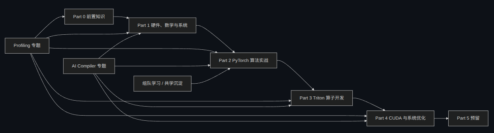
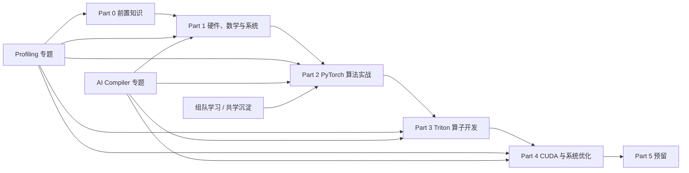
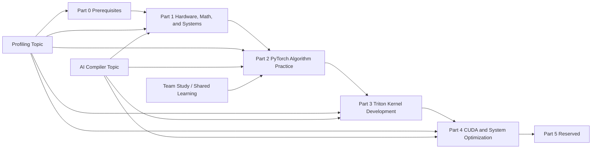

<h1 align="center">llm-algo-leetcode | 大模型算法与系统教程</h1>
<p align="center">Notebook-first tutorial for LLM algorithms and systems.<br>面向大模型算法与系统的 Notebook-first 教程。</p>

> [!WARNING]
> 🧪 Beta公测版本提示：教程主体代码与算子已基本构建完成，正在持续优化文档细节与补充注释。欢迎大家提交 Issue 反馈问题或贡献 PR！

>
> A practical tutorial with theory, walkthroughs, test cases, and solutions.

[中文版 (Chinese)](#中文版) | [English Version](#english-version)

---

# 中文版

## 🎯 项目简介

这是一个面向大模型入门到进阶的算法实战教程，以 LLM 为主线，帮助读者通过可运行、可验证、可回顾的 Notebook，从“会看”走到“会写、会调、会优化”。

### ✨ 项目特点

1. **主线清晰**：从基础能力到 Triton / CUDA 系统优化，形成完整学习链。
2. **工程导向**：以 Notebook 实战为载体，强调动手实现与性能意识。
3. **覆盖广泛**：从 PyTorch、Transformer 到推理优化、显存管理与底层实现都有对应内容。

### 👥 适合对象

- **求职面试者**：巩固 LLM 算法工程师、AI 架构师、算子开发工程师的高频考点。
- **AI 研发人员**：从代码底层理解显存优化、分布式通信与 Triton/CUDA 算子。

### 📌 学习前提

- 具备 Python 和深度学习基础，熟悉 PyTorch。
- 高阶内容需要一定 C++/CUDA 基础。

## 🌐 教程总览

这套教程分为纵深主线、横切专题和共学沉淀三层：`Part 0` 和 `Part 1` 是共同前置，`Part 2 -> Part 5` 是主线实战层，`topic_discussion` 承载 profiling、AI compiler 等跨 Part 主题，`team_study` 则单独作为动态共学沉淀层，当前主要对应 Part 2。整体关系可以理解为前置打底 -> PyTorch 主线 -> Triton -> CUDA，横切专题和组队学习分别服务于性能分析、编译视野和共学沉淀。





### 📚 资产总览

这套教程不要求从 `00` 开始按顺序硬读。`00` 主要是前置补齐区，如果你已有基础，可以直接从最相关的部分开始；下面这张表会直接告诉你：每一部分学什么、包含哪些组、适合谁、当前进度如何。

| 部分 | 组别 | 内容定位 | 适合对象 | 状态 |
| ---- | ---- | ---- | ---- | ---- |
| [`第零部分：前置知识与环境准备（5 组 / 20 节，已完成，持续优化）`](./00_Prerequisites/intro.md) | [`0A Python 基础与数据表示（4 节）`](./00_Prerequisites/0A.md) / [`0B PyTorch 张量与自动求导（4 节）`](./00_Prerequisites/0B.md) / [`0C PyTorch 模型构建（4 节）`](./00_Prerequisites/0C.md) / [`0D 训练与模型直觉（4 节）`](./00_Prerequisites/0D.md) / [`0E 调试与性能（4 节）`](./00_Prerequisites/0E.md) | 把 Python、NumPy、PyTorch、训练循环、调试工具和性能意识搭好。 | 第一次进入教程、需要补齐入门前置的人。 | ✅ 已完成，持续优化 |
| [`第一部分：硬件、数学与系统（5 组 / 33 节，已完成，持续优化）`](./01_Hardware_Math_and_Systems/intro.md) | [`1A 数值基础与算力估算（4 节）`](./01_Hardware_Math_and_Systems/1A.md) / [`1B 单卡硬件与访存优化（5 节）`](./01_Hardware_Math_and_Systems/1B.md) / [`1C 多卡通信与显存共享（5 节）`](./01_Hardware_Math_and_Systems/1C.md) / [`1D 异构调度与算子编程（5 节）`](./01_Hardware_Math_and_Systems/1D.md) / [`1E 编译优化与硬件生态（4 节）`](./01_Hardware_Math_and_Systems/1E.md) | 理解硬件、算力、访存、通信和调度这些底层约束。 | 想先弄清“为什么要这样写”和“为什么要这样部署”的学习者。 | ✅ 已完成，持续优化 |
| [`第二部分：PyTorch 算法实战（9 组 / 33 节，已完成，持续优化）`](./docs/02_PyTorch_Algorithms/intro.md) | [`2.1 基础算子（5 节）`](./docs/02_PyTorch_Algorithms/intro.md) / [`2.2 模型架构（4 节）`](./docs/02_PyTorch_Algorithms/intro.md) / [`2.3 微调与训练技术（5 节）`](./docs/02_PyTorch_Algorithms/intro.md) / [`2.4 对齐技术（3 节）`](./docs/02_PyTorch_Algorithms/intro.md) / [`2.5 反向传播与显存优化（3 节）`](./docs/02_PyTorch_Algorithms/intro.md) / [`2.6 核心推理优化（3 节）`](./docs/02_PyTorch_Algorithms/intro.md) / [`2.7 高级推理优化（4 节）`](./docs/02_PyTorch_Algorithms/intro.md) / [`2.8 分布式与扩展（3 节）`](./docs/02_PyTorch_Algorithms/intro.md) / [`2.9 项目实战（3 节）`](./docs/02_PyTorch_Algorithms/intro.md) | 在 PyTorch 层把算法、模型和推理优化先跑通。 | 希望先用熟悉工具建立实现感的人。 | ✅ 已完成，持续优化 |
| [`第三部分：Triton 算子开发（5 组 / 15 节，已完成，持续优化）`](./docs/03_Triton_Kernels/intro.md) | [`3.1 基础篇（5 节）`](./docs/03_Triton_Kernels/intro.md) / [`3.2 过渡篇（2 节）`](./docs/03_Triton_Kernels/intro.md) / [`3.3 进阶A：Attention优化（3 节）`](./docs/03_Triton_Kernels/intro.md) / [`3.4 进阶B：推理优化（2 节）`](./docs/03_Triton_Kernels/intro.md) / [`3.5 项目篇（3 节）`](./docs/03_Triton_Kernels/intro.md) | 把前面学到的算子和优化思路落到 GPU kernel。 | 希望从 PyTorch 走向 Triton 的学习者。 | ✅ 已完成，持续优化 |
| [`第四部分：CUDA C++ 与系统优化（4 组 / 16 节，建设中）`](./docs/04_CUDA_and_System_Optimization/intro.md) | [`4.1 CUDA 编程基础（4 节）`](./docs/04_CUDA_and_System_Optimization/intro.md) / [`4.2 系统级性能优化（4 节）`](./docs/04_CUDA_and_System_Optimization/intro.md) / [`4.3 分布式训练工程（4 节）`](./docs/04_CUDA_and_System_Optimization/intro.md) / [`4.4 架构视野（4 节）`](./docs/04_CUDA_and_System_Optimization/intro.md) | 进一步下探到 CUDA、系统调优和工程化架构。 | 准备做底层性能优化和工程落地的人。 | 🛠 建设中 |
| [`第五部分：CUDA Rust（预留）`](./05_CUDA_Rust/intro.md) | 预留中 | 预留中 | 预留中 | 🚧 预留 |

### 🧭 专题总览

| 专题 | 覆盖范围 | 内容定位 | 适合对象 | 状态 |
| ---- | ---- | ---- | ---- | ---- |
| [`Profiling 专题`](./topic_discussion/profiling/intro.md) | 所有part | 性能意识、profiling 方法、瓶颈定位经验。 | 想系统补性能意识与排障方法的学习者。 | 🛠 建设中 |
| [`AI Compiler 专题`](./topic_discussion/ai_compiler/intro.md) | 所有part | 图优化、编译链路、自动优化策略。 | 想补齐编译视野与自动优化思路的学习者。 | 🛠 建设中 |

### 🤝 共学沉淀

| 模块 | 覆盖范围 | 内容定位 | 适合对象 | 状态 |
| ---- | ---- | ---- | ---- | ---- |
| [`组队学习专题`](./team_study/intro.md) | 不固定 | [`part2_l1_202606`](./team_study/part2_l1_202606/intro.md) / [`part2_l1_202607`](./team_study/part2_l1_202607/intro.md) / [`part2_l2_202607`](./team_study/part2_l2_202607/intro.md) | 想通过共学沉淀知识、题目与复盘记录的学习者。 | 🛠 建设中 |

## 🆕 更新时间线

- **2026-07-10**：[最新更新点]收紧了中文版首页的教材总览与状态列，校正了 `Part 0` / `Part 1` 的组名、节数和 `0E` 标题，并同步了相关导航与最近更新说明。
- **2026-06-26**：[最新更新点]收紧了中文版首页的教材总览、状态列和 mermaid 关系图，明确了 `Part 0-1` 的前置关系、`Part 2-5` 的主线关系，以及横向专题和组队学习的定位。
- **2026-06-15**：推进第零部分 / 第一部分的分组与导读收口，统一部分级导航，并完成网页底部评论区接入 GitHub Discussions，同时持续扩展第一部分的正文、桥接页与 Notebook 结构。
- **2026-06-13**：修复 dead link，并为未完成页面补充占位页，避免学习入口出现 404。
- **2026-04-21**：更新 Colab 徽章链接，统一指向官方 `datawhalechina` 仓库。
- **2026-04-20**：上线站点首页与部分导学；新增第零部分前置知识与第一部分练习内容，完善在线阅读入口与学习路径。
- **2026-04-18 ~ 2026-04-19**：集中重构第二部分 / 第三部分内容，优化 Notebook、答案区与算子实现说明。
- **2026-04-02**：完成教程核心 Notebook、文档与测试脚本的初始搭建。

> 路径兼容说明：第三部分已从 `03_CUDA_and_Triton_Kernels` 更名为 `03_Triton_Kernels`，CUDA / 系统优化内容拆分到第四部分。旧网页路径会保留迁移入口，建议新链接统一使用 `03_Triton_Kernels`。
## 🚀 快速开始

如果你想开始学习，不需要从 `00` 按顺序起步；在线站点的导学和目录是入口，不是硬性起点。Part 0 适合补基础，Part 1 / 2 / 3 / 4 可以按你的目标直接切入。需要运行 Notebook 时，Part 0 / 1 / 2 可以优先走 CPU-first，Part 3 / 4 需要 GPU 环境。环境与平台差异见 [使用指南](./docs/guide.md)。

### 学习路径

1. 在左侧侧边栏选择你当前最关心的部分
2. 点击 **📖 完整导学** 了解该部分的阅读顺序
3. 直接从对应 group 进入，不必先补完全部前置
4. 如果后面遇到知识缺口，再回到 Part 0 / Part 1 补基础
5. 环境和平台差异见 [使用指南](./docs/guide.md)

### 方式 1：在线阅读

访问在线站点：

[https://datawhalechina.github.io/llm-algo-leetcode/](https://datawhalechina.github.io/llm-algo-leetcode/)

适合：
- 先看目录再决定从哪一部分切入
- 先读部分导学，按目标跳转到对应 group
- Part 0 / 1 / 2 可以直接用 Colab CPU 跑练习
- Part 3 / 4 需要 Colab GPU runtime

### 方式 2：本地学习

```bash
git clone https://github.com/datawhalechina/llm-algo-leetcode.git
cd llm-algo-leetcode
conda env create -f environment.yml
conda activate llm_algo
jupyter lab
```

适合：
- 想在本地完整跑 Part 0 / 1 / 2 的 Notebook
- 想自己控制 Python / PyTorch / CUDA 版本
- 想做更稳定的离线调试
- Part 3 / 4 需要本地 NVIDIA GPU

### 方式 3：CNB 统一环境

如果你希望和仓库当前推荐环境保持一致，可以使用 CNB 统一环境入口。

适合：
- 团队协作
- 统一实验镜像
- 需要减少本地环境差异
- Part 0 / 1 / 2 可以用 CNB CPU
- Part 3 / 4 需要 CNB GPU 会话

CNB 的具体使用方式和适用范围见 [使用指南](./docs/guide.md)。

## 📖 更多资源

- [使用指南](./docs/guide.md) - 环境与学习方式
- [贡献指南](./docs/contributing.md) - 如何参与项目开发和测试
- [维护与发布手册](./docs/maintenance.md) - 部分、链接、测试与发布的维护约定
- [自动化测试脚本索引](./docs/maintenance.md#测试脚本索引) - 各类验证脚本入口

## 👨‍💻 贡献者名单

| 姓名 | 职责 | 简介 |
| :----| :---- | :---- |
| lynn_jingjing | 项目发起人 | 一个算法工程师 |

*(欢迎在此留下您的名字！)*

## 📄 开源协议

本项目采用 [CC BY-NC-SA 4.0](./LICENSE) 协议进行许可。

---

# English Version

## 🎯 Project Introduction

This is a practical LLM algorithm tutorial from beginner to advanced, built around runnable, verifiable notebooks that help you move from "reading" to "writing, debugging, and optimizing".

### ✨ Features

1. **Clear Main Line**: A complete learning chain from prerequisites to Triton / CUDA system optimization.
2. **Engineering-Oriented**: Notebook-based practice with hands-on implementation and performance awareness.
3. **Broad Coverage**: Covers PyTorch, Transformers, inference optimization, VRAM management, and low-level implementation.

### 👥 Suitable For

- **Job Seekers**: Reinforce common interview topics for LLM algorithm engineers, AI architects, and kernel developers.
- **AI Practitioners**: Understand VRAM optimization, distributed communication, and Triton/CUDA operators from the code level.

### 📌 Prerequisites

- Basic Python and deep learning knowledge, plus PyTorch familiarity.
- Advanced parts require some C++/CUDA background.

## 🌐 Tutorial Overview

This tutorial is organized into a vertical main line and two cross-cutting tracks: the main line connects `Part 0 -> Part 4 (with Part 5 reserved)`, `topic_discussion` covers profiling and AI compiler, and `team_study` is maintained as a separate collaborative-learning lane. The overview is summarized in the asset and topic tables below.




### 📚 Current Asset Overview

You do not need to start from `00` in strict order. `00` is the prerequisite lane; if you already have the background, jump directly to the part that matches your goal. The table below summarizes each part, its groups, its audience, and its status.

| Part | Groups | Content Positioning | Suitable For | Status |
| ---- | ---- | ---- | ---- | ---- |
| [部分导读：前置知识与环境准备（5 groups / 20 lessons）](./00_Prerequisites/intro.md) | [组内导读：0A Python Basics and Data Representation (4 lessons)](./00_Prerequisites/0A.md) / [组内导读：0B PyTorch Tensors and Autograd (4 lessons)](./00_Prerequisites/0B.md) / [组内导读：0C PyTorch Model Construction (4 lessons)](./00_Prerequisites/0C.md) / [组内导读：0D Training and Model Intuition (4 lessons)](./00_Prerequisites/0D.md) / [组内导读：0E Debugging and Performance (4 lessons)](./00_Prerequisites/0E.md) | Prerequisites, engineering basics, and notebook-first practice. | First-time learners who need prerequisite support. | ✅ Complete, continuously refining |
| [部分导读：硬件、数学与系统（5 groups / 33 lessons）](./01_Hardware_Math_and_Systems/intro.md) | [组内导读：1A Numerics and Compute Estimation (4 lessons)](./01_Hardware_Math_and_Systems/1A.md) / [组内导读：1B Single-GPU Memory and Access (5 lessons)](./01_Hardware_Math_and_Systems/1B.md) / [组内导读：1C Multi-GPU Communication and VRAM (5 lessons)](./01_Hardware_Math_and_Systems/1C.md) / [组内导读：1D Heterogeneous Scheduling and Operators (5 lessons)](./01_Hardware_Math_and_Systems/1D.md) / [组内导读：1E Compiler Optimization and Hardware Ecosystem (4 lessons)](./01_Hardware_Math_and_Systems/1E.md) | Hardware, compute estimation, memory access, communication, and scheduling constraints. | Learners who want to understand why things are written and deployed this way. | ✅ Complete, continuously refining |
| [部分导读：PyTorch 算法实战（9 groups / 33 lessons）](./docs/02_PyTorch_Algorithms/intro.md) | [组内导读：2.1 Basic Operators (5 lessons)](./docs/02_PyTorch_Algorithms/intro.md) / [组内导读：2.2 Model Architecture (4 lessons)](./docs/02_PyTorch_Algorithms/intro.md) / [组内导读：2.3 Fine-Tuning and Training (5 lessons)](./docs/02_PyTorch_Algorithms/intro.md) / [组内导读：2.4 Alignment Methods (3 lessons)](./docs/02_PyTorch_Algorithms/intro.md) / [组内导读：2.5 Backpropagation and VRAM Optimization (3 lessons)](./docs/02_PyTorch_Algorithms/intro.md) / [组内导读：2.6 Core Inference Optimization (3 lessons)](./docs/02_PyTorch_Algorithms/intro.md) / [组内导读：2.7 Advanced Inference Optimization (4 lessons)](./docs/02_PyTorch_Algorithms/intro.md) / [组内导读：2.8 Distributed and Scaling (3 lessons)](./docs/02_PyTorch_Algorithms/intro.md) / [组内导读：2.9 Projects (3 lessons)](./docs/02_PyTorch_Algorithms/intro.md) | PyTorch-level practice for algorithms, models, and inference optimization. | Learners who want to build implementation intuition with familiar tools. | ✅ Complete, continuously refining |
| [部分导读：Triton Kernel Development (5 groups / 15 lessons)](./docs/03_Triton_Kernels/intro.md) | [组内导读：3.1 Foundations (5 lessons)](./docs/03_Triton_Kernels/intro.md) / [组内导读：3.2 Transition (2 lessons)](./docs/03_Triton_Kernels/intro.md) / [组内导读：3.3 Advanced A: Attention Optimization (3 lessons)](./docs/03_Triton_Kernels/intro.md) / [组内导读：3.4 Advanced B: Inference Optimization (2 lessons)](./docs/03_Triton_Kernels/intro.md) / [组内导读：3.5 Projects (3 lessons)](./docs/03_Triton_Kernels/intro.md) | Triton kernel development. | Learners who want to move from PyTorch to Triton. | ✅ Complete, continuously refining |
| [Part 4: CUDA C++ and System Optimization (4 groups / 16 lessons)](./docs/04_CUDA_and_System_Optimization/intro.md) | [4.1 CUDA Programming Basics (4 lessons)](./docs/04_CUDA_and_System_Optimization/intro.md) / [4.2 System-Level Performance Optimization (4 lessons)](./docs/04_CUDA_and_System_Optimization/intro.md) / [4.3 Distributed Training Engineering (4 lessons)](./docs/04_CUDA_and_System_Optimization/intro.md) / [4.4 Architecture Perspective (4 lessons)](./docs/04_CUDA_and_System_Optimization/intro.md) | CUDA C++ and system optimization. | Learners preparing for low-level performance optimization and engineering deployment. | 🛠 In progress |
| [Part 5: CUDA Rust (reserved)](./05_CUDA_Rust/intro.md) | Reserved | Reserved | Reserved | 🚧 Reserved |

### 🧭 Topic Overview

| Topic | Coverage | Content Positioning | Suitable For | Status |
| ---- | ---- | ---- | ---- | ---- |
| [Topic Discussion Axis](./topic_discussion/intro.md) | All parts | Cross-Part topic discussion and case stitching. | Learners who want to consolidate methods and cases across parts. | 🛠 In progress |
| [Profiling Topic](./topic_discussion/profiling/intro.md) | All parts | Performance awareness, profiling methods, bottleneck localization. | Learners who want systematic performance diagnosis and debugging methods. | 🛠 In progress |
| [AI Compiler Topic](./topic_discussion/ai_compiler/intro.md) | All parts | Graph optimization, compiler pipelines, automated optimization strategies. | Learners who want compiler vision and automated optimization ideas. | 🛠 In progress |

### 🤝 Collaborative Study

| Module | Coverage | Content Positioning | Suitable For | Status |
| ---- | ---- | ---- | ---- | ---- |
| [Team Study Topic](./team_study/intro.md) | Not fixed | [part2_l1_202606](./team_study/part2_l1_202606/intro.md) / [part2_l1_202607](./team_study/part2_l1_202607/intro.md) / [part2_l2_202607](./team_study/part2_l2_202607/intro.md) | Learners who want to accumulate knowledge and review records through collaborative study. | 🛠 In progress |

## 🆕 Update Timeline

- **2026-07-10**: [Latest update] tightened the English homepage asset overview and status columns, aligned the part/group counts with the current source structure, and refreshed the topic and team-study status tables.
- **2026-06-26**: [Latest update] improved the Chinese homepage overview and clarified the learning path across Parts 3 and 4, making the entry points and study order more intuitive.
- **2026-06-15**: Finalized the Part 0 / 1 grouping and guide cleanup, unified the part-level navigation, connected the page comments to GitHub Discussions, and continued expanding Part 1 content, bridge pages, and notebook structure.
- **2026-06-13**: Fixed dead links and added placeholder pages for unfinished content to prevent 404s in learning entry points.
- **2026-04-21**: Updated Colab badges to point to the official `datawhalechina` repository.
- **2026-04-20**: Launched the site homepage and part guides; added Part 0 prerequisites and Part 1 practice content to unify the learning path.
- **2026-04-18 ~ 2026-04-19**: Refactored Part 2 / 3 content, polishing notebooks, answer sections, and operator implementation notes.
- **2026-04-02**: Completed the initial tutorial notebooks, docs, and test scripts.

> Path compatibility note: Part 3 has been renamed from `03_CUDA_and_Triton_Kernels` to `03_Triton_Kernels`, and CUDA / system optimization content has moved to Part 4. Old web paths keep migration pages, but new links should use `03_Triton_Kernels`.

## 🚀 Quick Start

You do not need to start from Part 0 in order; Part 0 is the prerequisite lane, and you can jump directly to the part that matches your goal.

### Option 1: Read Online

Visit the online platform:

[https://datawhalechina.github.io/llm-algo-leetcode/](https://datawhalechina.github.io/llm-algo-leetcode/)

Suitable for:
- Skimming the table of contents first and then jumping to the part you need
- Reading the part guides first
- Part 0 / 1 / 2 can run on Colab CPU
- Part 3 / 4 need a Colab GPU runtime

### Option 2: Local Development

```bash
git clone https://github.com/datawhalechina/llm-algo-leetcode.git
cd llm-algo-leetcode
conda env create -f environment.yml
conda activate llm_algo
jupyter lab
```

Suitable for:
- Running Part 0 / 1 / 2 locally on CPU
- Controlling your own Python / PyTorch / CUDA versions
- More stable offline debugging
- Part 3 / 4 require a local NVIDIA GPU

For environment details and platform differences, see the Chinese guide section or [docs/guide.md](./docs/guide.md).

### Option 3: CNB Unified Delivery

If you want the same runtime style used by the repository, use the CNB unified environment.

Suitable for:
- Team collaboration
- Consistent experiment images
- Lower local environment drift
- Part 0 / 1 / 2 can use CNB CPU
- Part 3 / 4 need a CNB GPU session

See [docs/guide.md](./docs/guide.md) for the exact environment rules and scope.

## 📖 More Resources

- [docs/guide.md](./docs/guide.md) - environment and learning modes
- [docs/contributing.md](./docs/contributing.md) - how to contribute to development and testing
- [docs/maintenance.md](./docs/maintenance.md) - maintenance rules for parts, links, tests, and releases
- [Automated Test Script Index](./docs/maintenance.md#测试脚本索引) - entry points for automated verification scripts

## 👨‍💻 Contributors

| Name | Role | Description |
| :---- | :---- | :---- |
| lynn_jingjing | Project initiator | An algorithm engineer |

*(Feel free to add your name here! )*

## 📄 License

This project is licensed under [CC BY-NC-SA 4.0](./LICENSE).
