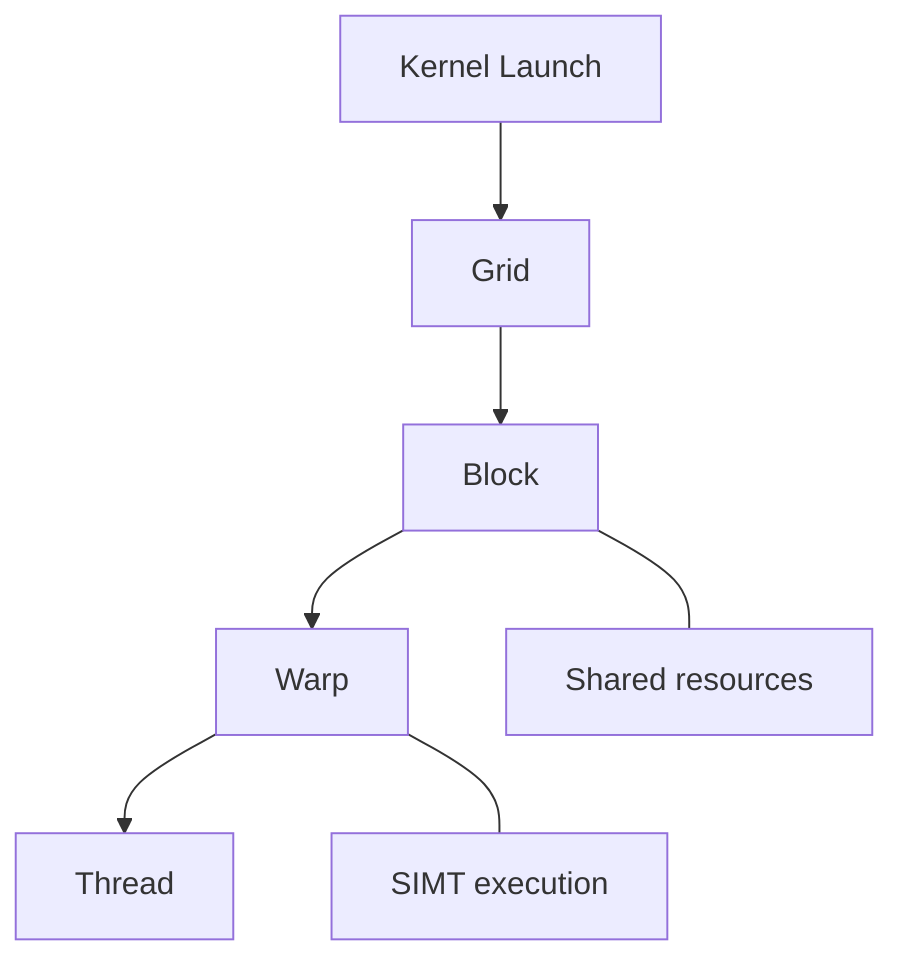
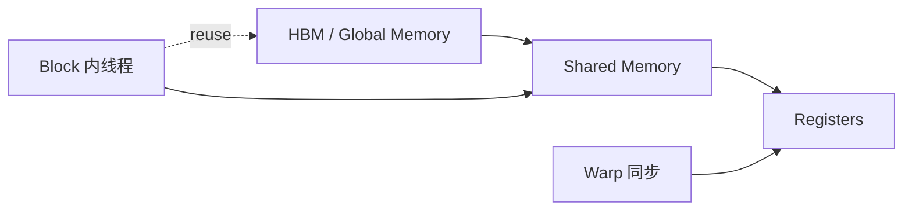
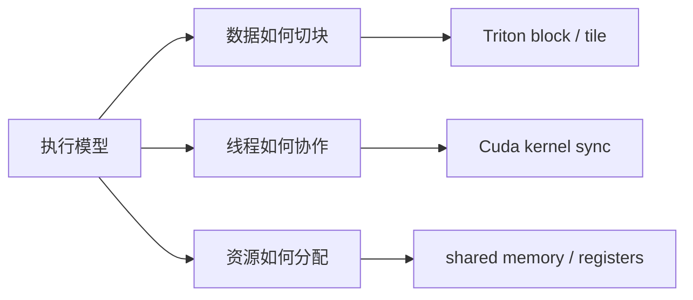

# 15. CUDA Execution Model | CUDA 执行模型

**难度：** Medium | **环境：** GPU optional | **标签：** `CUDA`, `Kernel`, `Execution Model` | **目标人群：** CUDA 入门者

> 🚀 **云端运行环境**
>
> 本章节的实战代码可以点击以下链接在免费 GPU 算力平台上直接运行：
>
> [](https://colab.research.google.com/github/datawhalechina/llm-algo-leetcode/blob/main/01_Hardware_Math_and_Systems/15_CUDA_Execution_Model.ipynb)
> [](https://modelscope.cn/my/mynotebook) *(国内推荐：魔搭社区免费实例)*


**关键词：** `grid`, `block`, `warp`

这一页把 GPU 上 kernel 的执行层级讲清楚，先知道程序是怎么被切成 grid / block / warp / thread，再去看 Triton 和 CUDA 实战代码。
## 前置阅读

**导语：** 先把 GPU 上的执行层级对齐，再看 kernel 为什么要按 block 组织会更顺。

- [Group 1B: Single-GPU Hardware and Memory Optimization | 1B: 单卡硬件与访存优化](./1B.md)
- [Group 1D: Heterogeneous Scheduling and Operator Programming | 1D: 异构调度与算子编程](./1D.md)
- [13. Profiling and Bottleneck Analysis | 性能分析与瓶颈定位](./13_Profiling_and_Bottleneck_Analysis.md)

## 相关阅读

**导语：** 把执行模型和 Triton 的 block 思维放一起看，后面写 kernel 会更稳。

- [Part 03: Triton Kernel Development | 第三部分：Triton 算子开发](../03_Triton_Kernels/intro.md)
- [01. Triton 入门与 Hello World：向量加法 (Vector Addition)](../03_Triton_Kernels/01_Triton_Vector_Addition.md)
- [04. Triton 矩阵乘法 (GEMM) 与自动调优 (Autotune)](../03_Triton_Kernels/04_Triton_GEMM_Tutorial.md)

## Q1：GPU 上的 kernel 为什么不是“一个线程在跑”？

<details>
<summary>点击展开查看解析</summary>

GPU 的执行不是单线程串行模型，而是分层并行模型。

- **Grid**：一次 kernel launch 对应的整体任务集合。
- **Block**：同一批线程的协作单元，通常共享片上资源。
- **Warp**：硬件真正调度和执行的基本粒度，通常是 32 个线程一组。
- **Thread**：最小执行单元。

理解这个层次很重要，因为 kernel 的性能不是只看“写了多少代码”，而是看任务被切成什么粒度、线程之间怎么协作、以及硬件怎么把这些线程排进执行队列。



所以 GPU 不是“很多线程在随便跑”，而是一个有明确层级和调度约束的执行系统。
</details>
### Q1小验证：把层级顺序记住

先记住 grid / block / warp / thread 的关系，再去看 kernel 代码会更顺。

```python
def warp_count(num_threads, warp_size=32):
    # 线程会被打包成 warp，warp 数量决定了并行执行的粗粒度。
    return (num_threads + warp_size - 1) // warp_size

for threads in [64, 128, 256]:
    print(threads, 'threads ->', warp_count(threads), 'warps')

```

## Q2：block 和 warp 的分工是什么，为什么 shared memory 这么重要？

<details>
<summary>点击展开查看解析</summary>

Block 是线程协作的主要边界，Warp 是真正执行时最常见的同步单位。

- **Block** 适合做局部协作、数据复用和共享内存管理。
- **Warp** 适合做更细粒度的同步和寄存器级协作。

Shared memory 之所以重要，是因为它位于 HBM 和寄存器之间，速度更快，且适合 block 内线程共享数据。很多 kernel 优化的关键，不是把计算写得更多，而是把数据尽量留在 shared memory 里，减少反复访问 HBM。



这就是为什么后面看 Triton block 模型或 FlashAttention 时，shared memory 总会反复出现：它是 block 协作和数据复用的核心舞台。
</details>
### Q2小验证：协作粒度和存储层级

先分清 block、warp 和 shared memory 各自负责什么。

```python
def traffic_with_block_reuse(blocks, reuse_factor, hbm_cost=10, smem_cost=2):
    # 同样的数据如果能在 block 内复用，就能把一部分 HBM 访问换成 shared memory 访问。
    return blocks * (hbm_cost + (reuse_factor - 1) * smem_cost)

for reuse in [1, 2, 4]:
    print('reuse', reuse, '->', traffic_with_block_reuse(8, reuse))
print('higher reuse means cheaper reuse path')

```

## Q3：为什么先理解执行模型，后面学 Triton 和 CUDA 会快很多？

<details>
<summary>点击展开查看解析</summary>

Triton 和 CUDA 不是先学语法再学性能，而是先理解执行模型，再把代码映射到硬件层级。

如果不知道 grid / block / warp 的关系，就很难理解：
- 为什么某些 kernel 需要按 block 组织数据；
- 为什么 shared memory 能带来收益；
- 为什么某些优化要避免过多同步；
- 为什么一个小改动会明显改变吞吐。



执行模型是后面所有 kernel 优化的共同前提。先把这层讲清楚，后面的 Triton block、mask、tile、fusion 才不会像单纯的术语堆叠。
</details>
### Q3小验证：先想执行模型，再想代码

看到 kernel 代码时，先问自己它对应的是哪一层。

```python
def choose_execution_mode(block_work, shared_need, sync_need):
    # block 负责共享和协作，warp 负责同步，thread 负责独立计算。
    if shared_need and block_work > 1:
        return 'block-centric'
    if sync_need:
        return 'warp-centric'
    return 'thread-centric'

cases = [
    (4, True, False),
    (1, False, True),
    (1, False, False),
]
for case in cases:
    print(case, '->', choose_execution_mode(*case))

```

## ⚠️ 常见误区

- GPU 不是“一个线程一个线程顺着跑”，而是分层并行调度。
- block 和 warp 不是同一层概念，前者偏组织，后者偏执行。
- shared memory 不是越多越好，而是要配合 block 内的数据复用。
- 先懂执行模型，再看 kernel 代码，理解会快很多。