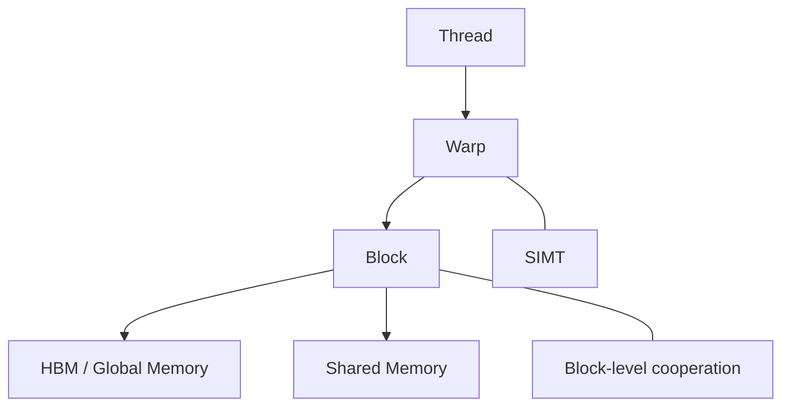
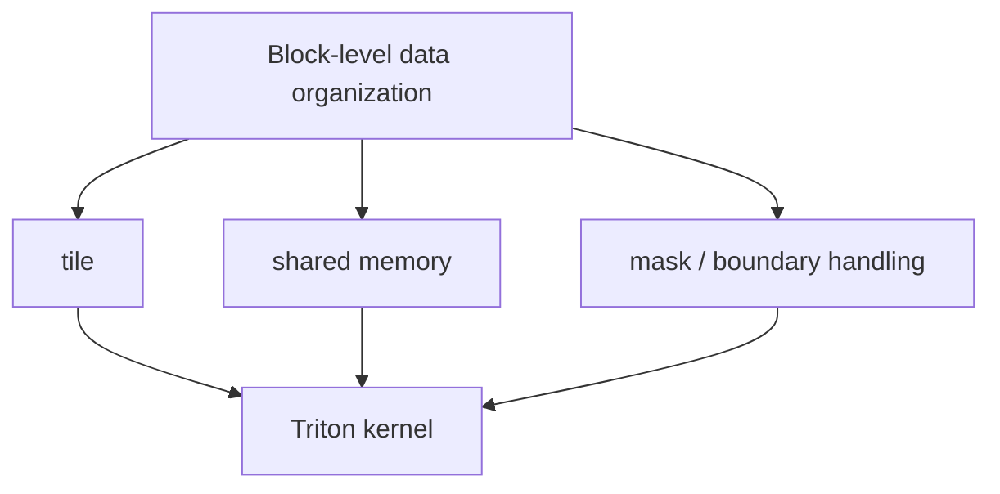

# 16. Warp Block SharedMemory Basics | Warp、Block 与 Shared Memory 基础

**难度：** Medium | **环境：** GPU optional | **标签：** `CUDA`, `Warp`, `Shared Memory` | **目标人群：** CUDA 入门者

> 🚀 **云端运行环境**
>
> 本章节的实战代码可以点击以下链接在免费 GPU 算力平台上直接运行：
>
> [](https://colab.research.google.com/github/datawhalechina/llm-algo-leetcode/blob/main/01_Hardware_Math_and_Systems/16_Warp_Block_SharedMemory_Basics.ipynb)
> [](https://modelscope.cn/my/mynotebook) *(国内推荐：魔搭社区免费实例)*


这一页把 warp、block 和 shared memory 的分工讲清楚，重点是先理解线程组织和片上复用，后面再看 Triton 和 CUDA 的块级实现会更顺。

**关键词：** `CUDA`, `Warp`, `Shared Memory`
## 前置阅读

**导语：** 先看执行层级，再看 shared memory 分工和片上复用会更顺。

- [Group 1B: Single-GPU Hardware and Memory Optimization | 1B: 单卡硬件与访存优化](./1B.md)
- [Group 1D: Heterogeneous Scheduling and Operator Programming | 1D: 异构调度与算子编程](./1D.md)
- [15. CUDA Execution Model | CUDA 执行模型](./15_CUDA_Execution_Model.md)

## 相关阅读

**导语：** 把 warp / block / shared memory 放到 Triton kernel 里看，更容易理解 tile 怎么落地。

- [Part 03: Triton Kernel Development | 第三部分：Triton 算子开发](../03_Triton_Kernels/intro.md)
- [02. Triton 算子开发：融合门控激活函数 (Fused SwiGLU)](../03_Triton_Kernels/02_Triton_Fused_SwiGLU.md)
- [03. Triton 算子开发实战：Fused RMSNorm](../03_Triton_Kernels/03_Triton_Fused_RMSNorm.md)
- [06. Triton 进阶：跨线程归约与数值稳定 (Safe Softmax)](../03_Triton_Kernels/06_Triton_Fused_Softmax.md)

## Q1：warp、block 和 thread 分别负责什么？

<details>
<summary>点击展开查看解析</summary>

这三个概念处在不同层级：

- **Thread**：最小执行单元，负责执行最细粒度的工作。
- **Warp**：硬件实际调度的基本执行单元，通常 32 个线程一起执行相同指令。
- **Block**：程序组织与资源分配的基本单元，适合做协作、同步和局部复用。

理解它们的关键，不是死记名词，而是知道每一层解决什么问题。Thread 负责计算细节，Warp 负责并行执行，Block 负责协作边界。


</details>
### Q1小验证：先分清层级

把执行层和组织层区分开，再看 kernel 代码就不会混。

```python
def execution_coverage(num_threads, warp_size=32):
    # 一个 block 里会包含多少个 warp，决定了并行执行的覆盖面。
    warps = (num_threads + warp_size - 1) // warp_size
    return {'threads': num_threads, 'warps': warps, 'last_warp_utilization': num_threads % warp_size or warp_size}

for threads in [32, 64, 96]:
    print(execution_coverage(threads))

```

## Q2：为什么 shared memory 能显著改善块内复用？

<details>
<summary>点击展开查看解析</summary>

shared memory 位于 HBM 和寄存器之间，速度比 HBM 快得多，且适合 block 内线程共享。

它的价值在于：
- 避免同一批数据反复从 HBM 读取；
- 让 block 内多个线程复用同一份中间结果；
- 把中间状态保留在离计算更近的层级。

所以 shared memory 不是“更大的缓存”，而是“更适合 block 协作的局部高速缓冲”。很多 kernel 优化的收益，本质上都来自把数据搬到这里后减少了 HBM 访问。


</details>
### Q2小验证：复用为什么重要

同一份中间数据如果会被多次用到，就更适合放在 shared memory。

```python
def shared_reuse_gain(reuse_count, hbm_cost=10, smem_cost=2):
    # 复用越多，把同一份数据留在 shared memory 的收益越大。
    return hbm_cost + max(reuse_count - 1, 0) * smem_cost

for reuse_count in [1, 2, 4]:
    print('reuse', reuse_count, '-> cost', shared_reuse_gain(reuse_count))
print('shared memory pays off when reuse_count > 1')

```

## Q3：为什么后面学 Triton 时，shared memory 总会反复出现？

<details>
<summary>点击展开查看解析</summary>

Triton 的很多优化都围绕 block 级数据组织展开，而 block 级组织离不开 shared memory。

当你在 Triton 里做 tile、mask、fusion 或 block-wise reduction 时，本质上都是在决定：
- 哪些数据先放到片上；
- 哪些数据在 block 内共享；
- 哪些中间结果不必回到 HBM。

所以 shared memory 不是一个单独知识点，而是后续块级编程的核心基础。先把这层讲通，后面的 Triton kernel 就不会像一堆抽象参数。


</details>
### Q3小验证：看到 block 级优化时先想什么

先问自己：这里是不是在减少 HBM 访问、增加 block 内复用。

```python
def optimization_score(tiling, fusion, block_reduction):
    # 片上优化通常不是单点优化，而是多个手段叠加。
    score = 0
    score += 2 if tiling else 0
    score += 2 if fusion else 0
    score += 1 if block_reduction else 0
    return score

plans = [
    ('naive', False, False, False),
    ('tiled', True, False, False),
    ('fused', True, True, True),
]
for name, tiling, fusion, reduction in plans:
    print(name, '->', optimization_score(tiling, fusion, reduction))
print('higher score means less HBM traffic')

```

## ⚠️ 常见误区

- warp 不是 block，warp 是执行粒度，block 是组织粒度。
- shared memory 不是越大越好，关键在于 block 内复用是否足够。
- 看到 shared memory 不一定就是“更复杂”，很多时候只是把数据放到了更合适的位置。
- 先懂层级关系，再看 kernel 代码，理解会稳很多。