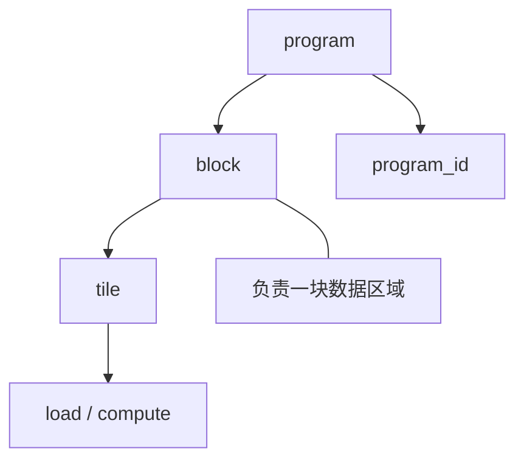
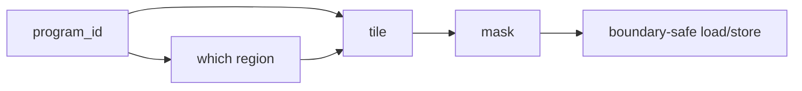

# 18. Triton Block Model | Triton Block 模型

**难度：** Medium | **环境：** GPU optional | **标签：** `Triton`, `Block Model`, `Kernel` | **目标人群：** Triton 入门者

> 🚀 **云端运行环境**
>
> 本章节的实战代码可以点击以下链接在免费 GPU 算力平台上直接运行：
>
> [](https://colab.research.google.com/github/datawhalechina/llm-algo-leetcode/blob/main/01_Hardware_Math_and_Systems/18_Triton_Block_Model.ipynb)
> [](https://modelscope.cn/my/mynotebook) *(国内推荐：魔搭社区免费实例)*


这一页把 Triton 的 block 思维讲清楚，重点是知道 program、block 和 tile 怎么对应到张量空间，后面写 kernel 时才知道代码在覆盖什么。

**关键词：** `program`, `block`, `tile`
## 前置阅读

**导语：** 先把执行层级和 stream 概念对齐，再看 Triton 的 program / block / tile 会更顺。

- [Group 1D: Heterogeneous Scheduling and Operator Programming | 1D: 异构调度与算子编程](./1D.md)
- [15. CUDA Execution Model | CUDA 执行模型](./15_CUDA_Execution_Model.md)
- [16. Warp Block SharedMemory Basics | Warp、Block 与 Shared Memory 基础](./16_Warp_Block_SharedMemory_Basics.md)
- [17. CUDA Stream and Asynchrony | CUDA Stream 与异步执行](./17_CUDA_Stream_and_Asynchrony.md)

## 相关阅读

**导语：** 把 Triton 的 block 模型和后面的 kernel 实现、FlashAttention 一起看，更容易串起来。

- [Part 03: Triton Kernel Development | 第三部分：Triton 算子开发](../03_Triton_Kernels/intro.md)
- [01. Triton 入门与 Hello World：向量加法 (Vector Addition)](../03_Triton_Kernels/01_Triton_Vector_Addition.md)
- [04. Triton 矩阵乘法 (GEMM) 与自动调优 (Autotune)](../03_Triton_Kernels/04_Triton_GEMM_Tutorial.md)
- [08. Triton Flash Attention | 真正的 Flash Attention 前向算子](../03_Triton_Kernels/08_Triton_Flash_Attention.md)

## Q1：Triton 里的 program、block 和 tile 分别是什么？

<details>
<summary>点击展开查看解析</summary>

Triton 的核心不是“写函数”，而是“把张量切成块，然后让每个 program 负责其中一块”。

- **program**：Triton 运行时分配的执行单元，可以理解成一个负责某个块的工作实例。
- **block**：一个 program 负责处理的那部分数据，也就是局部计算单元。
- **tile**：数据切分后的具体块形状，通常是 program 需要加载和处理的张量片段。

三者关系很像“任务实例 - 负责区域 - 切块形状”。如果不先把这层关系想清楚，后面看到 `program_id`、`tl.arange` 和 `mask` 时就很容易只记语法，不知道它们在空间上对应什么。


</details>
### Q1小验证：先分清概念

把 program、block 和 tile 先对上号，再看 kernel 会顺很多。

```python
def execution_shape(programs, blocks_per_program, tiles_per_block):
    # Triton 里 program / block / tile 不是三个名词，而是三层执行粒度。
    total_tiles = programs * blocks_per_program * tiles_per_block
    return {'programs': programs, 'blocks': blocks_per_program, 'tiles': total_tiles}

for case in [(1, 4, 8), (2, 2, 8), (4, 1, 8)]:
    print(case, '->', execution_shape(*case))
print('more programs do not always mean more useful tiles')

```

## Q2：为什么 Triton 要强调“先布局，再写细节”？

<details>
<summary>点击展开查看解析</summary>

Triton 的写法先强调数据怎么切块、怎么映射、怎么覆盖整个张量，然后才决定具体算什么。

这是因为 kernel 的性能往往不是先被算法名决定，而是先被数据组织方式决定。块切得合不合理、映射是否连续、每个 program 的职责是否清晰，都会影响后面的访存和复用。

所以 Triton 看起来像在写“布局代码”，其实是在决定每个块如何靠近计算单元、如何减少无效搬运、以及如何把张量空间映射成更规整的执行单元。
</details>
### Q2小验证：为什么布局先行

先考虑块怎么铺，再考虑块里怎么算。

```python
def layout_first(step, tile=128, elements=4096):
    # 先确定切分方式，再看映射和计算，才不会把 tile 和 layout 搞混。
    if step == 0:
        return {'tiles': (elements + tile - 1) // tile}
    if step == 1:
        return {'tile': tile, 'contiguous': True}
    return {'compute': 'local'}

for i in range(3):
    print(i, '->', layout_first(i))
print('layout-first means shape decides the rest of the kernel')

```

## Q3：为什么 program_id、mask 和 tile 会在 Triton 里反复出现？

<details>
<summary>点击展开查看解析</summary>

因为它们共同描述了“一个 program 该处理哪一块数据，以及越界时该怎么安全处理”。

- `program_id` 决定当前 program 的身份和位置；
- `tile` 决定它负责的数据块形状；
- `mask` 决定边界处哪些元素有效、哪些元素需要屏蔽。

这三者一起出现，说明 Triton 的核心不是单点计算，而是块级覆盖、边界处理和空间映射。如果你能在脑子里把这三者连起来，后面的 GEMM、softmax、FlashAttention kernel 会更容易读。


</details>
### Q3小验证：看到 kernel 先找哪三个东西

先找 program_id、tile 和 mask，再看它怎么覆盖空间。

```python
def kernel_check(tile, mask, boundary, valid_ratio=1.0):
    # program_id / tile / mask 的关系，核心是越界是否安全且有效。
    safe = boundary or mask
    useful = valid_ratio > 0.7
    return {'safe': safe, 'useful': useful, 'ready': safe and useful}

for case in [(128, True, True, 0.98), (256, False, True, 0.65), (128, False, False, 0.9)]:
    print(case, '->', kernel_check(*case))
print('mask matters because not every tile is fully valid at the boundary')

```

## ⚠️ 常见误区

- Triton 的 program 不是 Python 里的普通函数调用。
- block 不只是“一个小矩阵”，它更是一个 program 的责任范围。
- tile 不是为了好看，而是为了把空间映射和数据复用组织好。
- 先懂 block 思维，再看 kernel 代码，会比先背语法更有效。