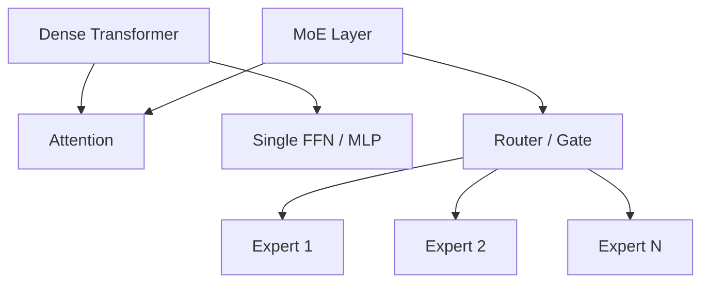
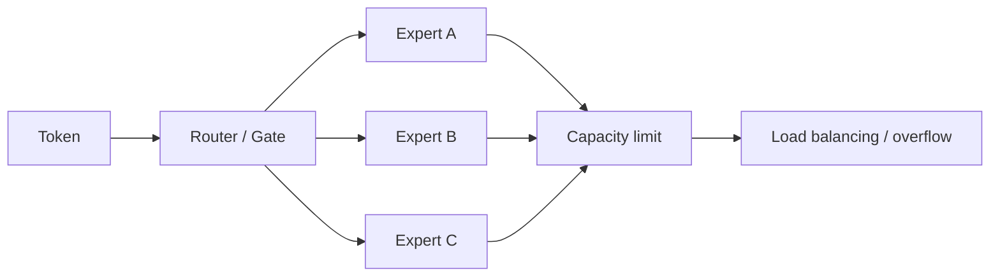

# 22. MoE Parameter and Compute | MoE 模型参数量计算

**难度：** Medium-Hard | **环境：** CPU-first | **标签：** `MoE`, `路由` | **目标人群：** MoE 学习者

> 🚀 **云端运行环境**
>
> 本章节的实战代码可以点击以下链接在免费 GPU 算力平台上直接运行：
>
> [](https://colab.research.google.com/github/datawhalechina/llm-algo-leetcode/blob/main/01_Hardware_Math_and_Systems/22_MoE_Parameter_and_Compute.ipynb)
> [](https://modelscope.cn/my/mynotebook) *(国内推荐：魔搭社区免费实例)*


MoE 的核心不是“参数越多越好”，而是把模型容量和每次推理/训练时真正激活的计算量分开。它是一个非常典型的“总参数大，但激活参数不一定大”的设计。

**关键词：** `experts`, `router`, `load balancing`

## 前置阅读

**导语：** 这一页先接上参数量、显存和分布式通信的基础判断，这样才更容易看清 MoE 为什么会出现“总参数大、活跃计算量没那么大”的现象。

- [01. Data Types and Precision | 大模型的数据格式与混合精度](./01_Data_Types_and_Precision.md)
- [02. LLM Params and FLOPs | 大模型参数量与算力推导](./02_LLM_Params_and_FLOPs.md)
- [05. Communication Topologies | 通信拓扑与分布式基石](./05_Communication_Topologies.md)

## 相关阅读

**导语：** 如果还想继续看 MoE 和工程决策、通信成本的关系，可以接着看显存计算、并行策略和成本模型这几页。

- [06. VRAM Calculation and ZeRO | 显存计算与 ZeRO 优化](./06_VRAM_Calculation_and_ZeRO.md)
- [20. NCCL and AllReduce Basics | NCCL 与 AllReduce 基础](./20_NCCL_and_AllReduce_Basics.md)
- [26. Parallel Strategy Decision Framework | 并行策略决策框架](./26_Parallel_Strategy_Decision_Framework.md)
- [33. TCO and Cost Model | 算力评估与 TCO 模型](./33_TCO_and_Cost_Model.md)

## Q1：MoE 和普通 dense Transformer 的参数量差别在哪里？

<details>
<summary>点击展开查看解析</summary>

普通 dense Transformer 的每层参数主要来自：
- Attention
- FFN / MLP

而 MoE 会把原本的 FFN / MLP 替换成多个专家（experts）。粗略地说：

- 一个 dense FFN 的参数量约为 `2 d d_ff`
- 如果有 `E` 个专家，那么专家总参数量约为 `E × 2 d d_ff`
- 但每个 token 通常只会激活 `k` 个专家，而不是全部 `E` 个

所以 MoE 的特点是：
- **总参数量**：很大
- **单 token 激活参数量**：相对没那么大
- **单 token 计算量**：通常按 `k` 而不是按 `E` 增长

这就是为什么 MoE 常被用来扩大模型容量，但不把每次计算都线性放大。

一个最常见的直觉例子是 Mixtral 8x7B：

| 维度 | 量级直觉 |
| --- | --- |
| 隐藏维度 `d` | 4096 |
| 专家数 `E` | 8 |
| 激活专家数 `k` | 2 |
| `d_ff` | 约 `4d = 16384` |

如果只看专家 FFN，单个专家参数量大约是 `2 × d × d_ff ≈ 134M`，8 个专家加起来大约 `1.07B` 级别。加上 Attention、Embedding 和其他层之后，模型总参数可以到 `47B` 左右，但每个 token 实际只激活其中一小部分，常见说法是“活跃参数”大约在 `13B` 量级。


</details>
### Q1小验证：计算 dense FFN 和 MoE 专家参数量

先把最基础的参数量公式写出来，再对比 dense 和 MoE 的差异。

```python
import math
from typing import Dict, List


def dense_ffn_params(d: int, d_ff: int) -> int:
    """Dense FFN/MLP 的参数量，按 2 * d * d_ff 估算。"""
    return 2 * d * d_ff


def moe_expert_params(d: int, d_ff: int, num_experts: int) -> int:
    """MoE 所有专家的总参数量。"""
    return num_experts * dense_ffn_params(d, d_ff)


def active_expert_params(d: int, d_ff: int, active_experts: int) -> int:
    """单个 token 激活的专家参数量。"""
    return active_experts * dense_ffn_params(d, d_ff)


def moe_layer_params(d: int, d_ff: int, num_experts: int, include_router: bool = True) -> int:
    """MoE 单层粗略参数量：Attention + Experts + Router。"""
    attention_params = 4 * d * d
    router_params = d * num_experts if include_router else 0
    return attention_params + moe_expert_params(d, d_ff, num_experts) + router_params


def to_million(x: int) -> float:
    return x / 1e6


def to_billion(x: int) -> float:
    return x / 1e9

```


```python
def test_moe_parameter_formulas():
    d = 4096
    d_ff = 16384
    experts = 8
    active = 2

    dense = dense_ffn_params(d, d_ff)
    total_expert = moe_expert_params(d, d_ff, experts)
    active_params = active_expert_params(d, d_ff, active)
    layer_params = moe_layer_params(d, d_ff, experts)

    assert dense == 134_217_728, dense
    assert total_expert == 1_073_741_824, total_expert
    assert active_params == 268_435_456, active_params
    assert layer_params == 1_140_883_456, layer_params
    print('✅ MoE 参数量公式测试通过')


test_moe_parameter_formulas()

print('单个 dense FFN 参数量:', to_million(dense_ffn_params(4096, 16384)), 'M')
print('8 个专家的总参数量:', to_billion(moe_expert_params(4096, 16384, 8)), 'B')
print('top-2 激活参数量:', to_billion(active_expert_params(4096, 16384, 2)), 'B')
print('MoE 单层粗略参数量:', to_billion(moe_layer_params(4096, 16384, 8)), 'B')

```

## Q2：Router / Gate 为什么重要？

<details>
<summary>点击展开查看解析</summary>

Router / Gate 决定的是：token 应该去哪个专家、每个专家会不会过载、以及路由结果会不会引入额外通信和同步开销。

从原理上看，Router 至少同时承担三件事：

1. **选择专家**
   - 对每个 token 打分，决定 top-k 专家是谁。
   - 这一步决定了 token 的计算路径，不同 token 可能走完全不同的专家。

2. **控制容量**
   - 每个专家能接收的 token 数量是有限的。
   - 如果 token 分布不均衡，某些专家会过载，部分 token 可能被丢弃或被迫重分配。

3. **影响训练稳定性**
   - 如果路由长期偏向少数专家，MoE 可能退化成“少数专家在工作，其余专家闲置”。
   - 所以很多方案会引入 load balancing loss 或容量因子，强迫路由更均匀。

这也是为什么 MoE 不只是“参数变多了”，它的工程难点其实在路由质量和负载均衡，而不是单纯在 FFN 参数本身。


</details>
### Q2小验证：观察 Router / Gate 的容量和负载均衡

先估算每个专家的容量，再看 token 分布不均时会发生什么。

```python
def expert_capacity(num_tokens: int, num_experts: int, capacity_factor: float = 1.0) -> int:
    """每个专家可接收的 token 数量上限。"""
    return math.ceil(num_tokens / num_experts * capacity_factor)


def overflow_tokens(token_counts: List[int], capacity: int) -> int:
    """给定每个专家接收的 token 数量，计算总溢出 token 数。"""
    return sum(max(0, c - capacity) for c in token_counts)


def load_balance_stats(token_counts: List[int], capacity: int) -> Dict[str, float]:
    total = sum(token_counts)
    overflow = overflow_tokens(token_counts, capacity)
    return {
        'total_tokens': total,
        'capacity_per_expert': capacity,
        'max_tokens': max(token_counts),
        'min_tokens': min(token_counts),
        'overflow_tokens': overflow,
        'drop_rate': overflow / total if total else 0.0,
    }

```


```python
token_counts = [140, 40, 70, 90, 110, 80, 60, 110]
capacity = expert_capacity(sum(token_counts), len(token_counts), capacity_factor=1.0)
stats = load_balance_stats(token_counts, capacity)

print('专家 token 分布:', token_counts)
print('每个专家容量上限:', capacity)
print('-' * 60)
for k, v in stats.items():
    if k.endswith('rate'):
        print(f'{k:20s}: {v:.1%}')
    else:
        print(f'{k:20s}: {v}')

```

## Q3：为什么 MoE 的工程代价不只在计算，还在通信？

<details>
<summary>点击展开查看解析</summary>

MoE 的额外代价主要来自专家并行（Expert Parallelism）下的 token 调度和 All-to-All 通信。

可以把这一层理解成：
- token 先按 Router 的结果分发到不同专家所在的设备
- 专家计算完成后，再把结果聚合回原来的序列位置

这意味着 MoE 的通信不是“顺手搬一点数据”，而是会在每一层都出现比较明确的分发 / 聚合过程。

如果 token 数、hidden_dim 或 batch 变大，通信量就会明显增加；如果 token 分布不均衡，某些专家设备还会比别的设备更忙，进一步放大尾部等待时间。

所以 MoE 的核心权衡可以概括成：
- **容量**：更大
- **激活计算**：不一定同比增大
- **系统复杂度**：更高，尤其是路由、负载均衡和通信


</details>
### Q3小验证：粗估专家并行通信量

先估算每层的通信量，再看它为什么会成为 MoE 的工程代价。

```python
def estimate_expert_parallel_traffic(
    batch: int,
    seq_len: int,
    hidden_dim: int,
    num_experts: int,
    num_devices: int,
    bytes_per_param: int = 2,
    dispatch_and_gather_factor: float = 2.0,
) -> int:
    """粗略估算专家并行的通信量（字节）。"""
    tokens = batch * seq_len
    traffic = tokens * hidden_dim * bytes_per_param
    traffic *= (num_experts / max(1, num_devices))
    traffic *= dispatch_and_gather_factor
    return int(traffic)


def bytes_to_mb(x: int) -> float:
    return x / 1e6


def bytes_to_gb(x: int) -> float:
    return x / 1e9

```


```python
batch = 8
seq_len = 2048
hidden_dim = 4096
num_experts = 8
num_devices = 8
traffic = estimate_expert_parallel_traffic(batch, seq_len, hidden_dim, num_experts, num_devices)

print('专家并行通信量粗估：')
print('-' * 60)
print(f'batch={batch}, seq_len={seq_len}, hidden_dim={hidden_dim}')
print(f'communication = {bytes_to_mb(traffic):.1f} MB / layer')
print(f'communication = {bytes_to_gb(traffic):.3f} GB / layer')

```


```python
def test_traffic_estimation():
    traffic_small = estimate_expert_parallel_traffic(4, 1024, 4096, 8, 8)
    traffic_large = estimate_expert_parallel_traffic(8, 2048, 4096, 8, 8)
    assert traffic_small > 0
    assert traffic_large > traffic_small
    assert traffic_large == 4 * traffic_small
    print('✅ 通信量测试通过')


test_traffic_estimation()

```

## Q4：MoE 什么时候适合，什么时候不适合？

<details>
<summary>点击展开查看解析</summary>

MoE 适合的场景通常有两个特征：

- 你想扩大模型容量，但不希望每次推理都把计算量一起放大
- 你能接受更复杂的路由、调度和通信实现

不太适合的场景通常是：
- 你更在意实现简单、稳定和可预测
- 你的系统带宽 / 通信条件并不理想
- 你很难接受路由不均衡带来的训练波动

一句话判断：
- 如果你的系统已经很强，且希望“总参数更大但单步计算别太重”，MoE 值得认真考虑
- 如果你的系统更看重工程简洁和稳定，dense 结构往往更省心
</details>
### Q4小验证：MoE 什么时候更值得用？

把容量收益、通信代价和工程复杂度放到一起，快速判断是否适合上 MoE。


```python
def moe_suitability(capacity_gain, comm_cost, balance_score, simplicity_need):
    score = capacity_gain * 2 - comm_cost * 2 + balance_score - simplicity_need
    if score >= 3:
        recommendation = 'MoE'
    elif score >= 0:
        recommendation = 'context-dependent'
    else:
        recommendation = 'dense'
    return {
        'recommendation': recommendation,
        'suitability_score': score,
    }

cases = [
    (4, 1, 2, 1),
    (2, 3, 1, 2),
    (3, 2, 0, 3),
]
for case in cases:
    print(case, '->', moe_suitability(*case))
print('MoE is attractive only when capacity gain can pay for routing and communication costs')

```
