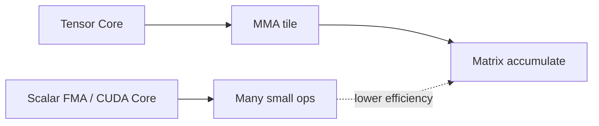
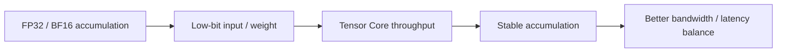
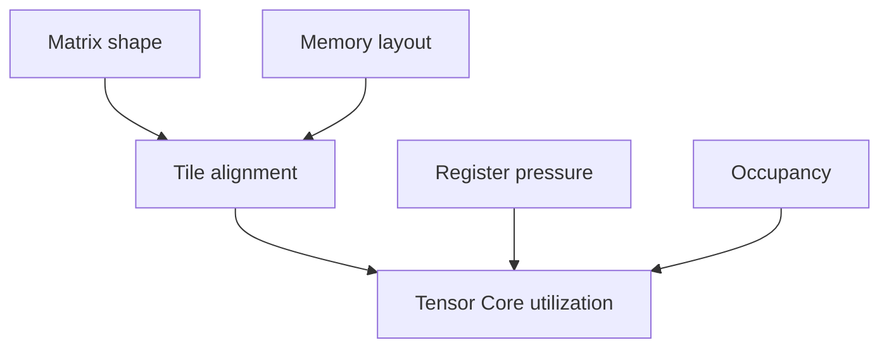

# 23. TensorCore Deep Dive | Tensor Core 深度剖析

**难度：** Hard | **环境：** GPU optional | **标签：** `Tensor Core`, `MMA`, `Mixed Precision` | **目标人群：** 核心算子开发者

> 🚀 **云端运行环境**
>
> 本章节的实战代码可以点击以下链接在免费 GPU 算力平台上直接运行：
>
> [](https://colab.research.google.com/github/datawhalechina/llm-algo-leetcode/blob/main/01_Hardware_Math_and_Systems/23_TensorCore_Deep_Dive.ipynb)
> [](https://modelscope.cn/my/mynotebook) *(国内推荐：魔搭社区免费实例)*


这一页讲的是 Tensor Core 为什么能把矩阵乘加做得更快，以及为什么它和精度、tile 和寄存器组织绑得这么紧。

**关键词：** `MMA`, `tile`, `throughput`
## 前置阅读

**导语：** 这一页先把矩阵乘加和混合精度的底层直觉接上，再看 Tensor Core 为什么会把 tile、精度和吞吐绑在一起。

- [15. CUDA Execution Model | CUDA 执行模型](./15_CUDA_Execution_Model.md)
- [16. Warp Block SharedMemory Basics | Warp、Block 与 Shared Memory 基础](./16_Warp_Block_SharedMemory_Basics.md)
- [12. TensorCore and Mixed Precision | Tensor Core 与混合精度](./12_TensorCore_and_Mixed_Precision.md)

## 相关阅读

**导语：** 如果想继续把 TensorCore 和更高层的 kernel / 编译优化串起来，可以接着看这些页。

- [08. Programming Models and CUDA/Triton | 编程模型演进](./08_Programming_Models_CUDA_Triton.md)
- [14. FlashAttention Memory Model | FlashAttention 显存模型](./14_FlashAttention_Memory_Model.md)
- [25. Sparse Computation and Sparse Attention | 稀疏计算与稀疏注意力](./25_Sparse_Computation_and_Sparse_Attention.md)

## Q1：Tensor Core 本质上是什么？

<details><summary>点击展开查看解析</summary>

Tensor Core 不是普通 CUDA Core 的更快版本，而是一条专门面向矩阵乘加（MMA）的硬件路径。

它的关键变化有三点：
- 计算对象从标量 FMA 变成了小块矩阵乘加；
- 调度粒度从逐元素运算变成了可打包的 tile；
- 数据路径从“多次标量访存”转成“先聚成块，再一次性做矩阵累加”。



所以 Tensor Core 更像是矩阵计算的专用引擎：它不是把同样的工作做得更快一点，而是把工作重新组织成更适合硬件吞吐的形状。
</details>
### Q1小验证：为什么打包计算更重要

先把“矩阵乘加”和“标量 FMA”区分开。

```python
def mma_flops(m, n, k):
    return 2 * m * n * k

print(mma_flops(16, 16, 16) / 1e3, 'KFLOPs for one 16x16x16 MMA')
```

## Q2：为什么精度和吞吐可以同时受益？

<details><summary>点击展开查看解析</summary>

混合精度之所以有效，是因为“输入 / 累加 / 输出”这三段不必使用同一种位宽。

常见做法是：
- 输入和权重用较低精度，减少搬运和打包成本；
- 累加保留更高精度，避免误差快速放大；
- 某些中间结果再按需要回到更低精度或保持高精度。



所以混合精度不是单纯“降精度”，而是在精度和吞吐之间拆分职责：把最贵的搬运和最需要吞吐的部分放到更合适的位宽和硬件路径上。
</details>
### Q2小验证：不同 dtype 占多少空间

先看数据类型切换对内存的直接影响。

```python
numel = 4096 * 4096
for name, bytes_per_elem in [('FP32', 4), ('FP16/BF16', 2), ('FP8', 1)]:
    print(name, '->', numel * bytes_per_elem / 1024 / 1024, 'MB')
```

## Q3：为什么 Tensor Core 利用率不是随便就能跑满？

<details><summary>点击展开查看解析</summary>

Tensor Core 的利用率受三个层面约束：
- **tile 是否对齐**：shape 不合适时，硬件难以把工作完整打包；
- **layout 是否连续**：布局不连续会让打包前后的访存变碎；
- **register / occupancy 是否允许**：临时变量太多时，算力单元未必能持续喂满。



因此，Tensor Core 利用率不是“用了就有”，而是要看输入尺寸、布局、同步方式和临时变量是否都允许它进入高吞吐路径。
</details>
### Q3小验证：对齐和打包为什么重要

适合的 shape 更容易进入高吞吐路径。

```python
def tensorcore_ready(m, n, k, tile=16):
    return all(x % tile == 0 for x in (m, n, k))

print(tensorcore_ready(128, 128, 128))
```

## Q4：这页最该避免的误区是什么？

<details><summary>点击展开查看解析</summary>

最常见的误区是把 Tensor Core 当成“只要启用就一定快”。

实际是否有收益，要同时看：
- 数据是否能按合适 tile 打包；
- 精度路径是否真的符合 Tensor Core 支持的 MMA 形式；
- kernel 是否因为布局或寄存器压力而掉回慢路径。

所以 Tensor Core 的核心不是“存在”，而是“是否被正确地喂满并持续喂满”。
</details>
### Q4小验证：什么时候才算真的用上了

先判断是否进入适合打包的 shape。

```python
def tensorcore_speedup(m, n, k, tile=16, align_ok=True, reuse=1):
    # 能不能吃满 Tensor Core，不只看有没有 MMA，而是看 tile、对齐和复用。
    if not align_ok:
        return {'speedup': 0.0, 'reason': 'misaligned'}
    tile_score = (m // tile) * (n // tile) * (k // tile)
    return {'speedup': round(max(tile_score, 1) * reuse / 10, 2), 'reason': 'aligned'}

cases = [(128, 128, 128, 16, True, 1), (130, 128, 128, 16, True, 1), (128, 128, 128, 16, False, 1), (128, 128, 128, 16, True, 3)]
for case in cases:
    print(case, '->', tensorcore_speedup(*case))
print('Tensor Core wins only when tile alignment and reuse both cooperate')

```
