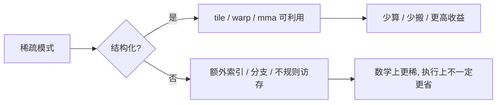

# 25. Sparse Computation and Sparse Attention | 稀疏计算与稀疏注意力

**难度：** Hard | **环境：** GPU optional | **标签：** `Sparse`, `Attention`, `Optimization` | **目标人群：** 稀疏优化入门者

> 🚀 **云端运行环境**
>
> 本章节的实战代码可以点击以下链接在免费 GPU 算力平台上直接运行：
>
> [](https://colab.research.google.com/github/datawhalechina/llm-algo-leetcode/blob/main/01_Hardware_Math_and_Systems/25_Sparse_Computation_and_Sparse_Attention.ipynb)
> [](https://modelscope.cn/my/mynotebook) *(国内推荐：魔搭社区免费实例)*


这一页讲的是稀疏化为什么不只是“删掉一部分元素”，而是要看结构、实现和硬件是否真的能受益。

**关键词：** `sparsity`, `structure`, `density`
## 前置阅读

**导语：** 这一页先把 shared memory、TensorCore 和量化后的执行路径接上，再看稀疏为什么不是单纯删掉几个参数。

- [24. SRAM Optimization Techniques | SRAM 优化技术](./24_SRAM_Optimization_Techniques.md)
- [23. TensorCore Deep Dive | Tensor Core 深度剖析](./23_TensorCore_Deep_Dive.md)
- [21. Quantization Theory and INT4/INT8 | 量化理论与 INT4/INT8](./21_Quantization_Theory_and_INT4_INT8.md)
- [22. MoE Parameter and Compute | MoE 模型参数量计算](./22_MoE_Parameter_and_Compute.md)

## 相关阅读

**导语：** 如果想继续把稀疏和调度、编译、执行路径的关系补完整，可以接着看这些页。

- [09. AI Compilers and Graph Optimization | AI 编译器与计算图优化](./09_AI_Compilers_and_Graph_Optimization.md)
- [18. Triton Block Model | Triton Block 模型](./18_Triton_Block_Model.md)
- [19. Operator Fusion Introduction | 算子融合导论](./19_Operator_Fusion_Introduction.md)

## Q1：为什么稀疏不一定只是“删参数”？

<details><summary>点击展开查看解析</summary>

稀疏的核心，不是“参数少了”，而是“少掉的那部分能不能真的从执行图里消失”。

如果只是把矩阵里很多位置置零，但 kernel 仍然按 dense 的方式扫描、广播和累加，零值就只是换了个存法，计算和搬运未必真的少。

所以稀疏化真正要回答的是：少掉的结构，能不能被块划分、索引方式和硬件执行单元一起利用起来。



这张图只想表达一件事：稀疏只有在能映射到规则执行路径时，才会真正转化成收益。
</details>
### Q1小验证：稀疏带来的不是自动加速

先判断稀疏是否能被执行路径真正利用。

```python
def useful_sparsity(density, hardware_support=True, structure='block'):
    # 稀疏是否有用，不是看 density 低不低，而是看结构和硬件能不能把它吃进去。
    structure_bonus = {'block': 1.0, 'row': 0.8, 'column': 0.8, 'random': 0.3}.get(structure, 0.3)
    return round((1 - density) * structure_bonus, 2) if hardware_support else 0.0

for density, structure in [(0.1, 'block'), (0.5, 'block'), (0.5, 'random'), (0.8, 'row')]:
    print((density, structure), '->', useful_sparsity(density, True, structure))
print('useful sparsity needs both low density and hardware-friendly structure')

```

## Q2：为什么结构化稀疏比非结构化稀疏更容易落地？

<details><summary>点击展开查看解析</summary>

结构化稀疏会把稀疏模式固定成硬件更容易识别和优化的形状。

非结构化稀疏虽然灵活，但执行时更难真正减少无效工作，很多时候只是在数据上变稀疏，没能在执行上变稀疏。
</details>
### Q2小验证：为什么规则形状更容易优化

规则越强，执行越容易利用。

```python
def structured_score(shape='block', hardware='mma'):
    # 越规则的形状越容易进入硬件优化路径。
    shape_score = {'block': 3, 'row': 2, 'column': 2, 'random': 0}.get(shape, 0)
    hw_score = 2 if hardware in ['mma', 'tensorcore'] else 1
    return shape_score + hw_score

cases = [('block', 'mma'), ('row', 'mma'), ('random', 'mma'), ('block', 'cpu')]
for shape, hw in cases:
    print((shape, hw), '->', structured_score(shape, hw))
print('structured sparse is easier for hardware to exploit because the mapping is predictable')

```

## Q3：为什么 Attention 和 MLP 都可能受益于稀疏化？

<details><summary>点击展开查看解析</summary>

Attention 和 MLP 都有大量重复计算和搬运的机会。

如果稀疏模式和硬件执行路径匹配，就可能减少计算量、内存流量或两者兼有。

但收益是否成立，仍然取决于稀疏结构是否能被真正利用。
</details>
### Q3小验证：稀疏能不能落到执行上

先看硬件有没有能力把它吃进去。

```python
def sparse_gain(model='attention', density=0.3, structure='block'):
    # 稀疏收益取决于模型、密度和结构是否都能落到执行路径上。
    base = {'attention': 3, 'mlp': 2}.get(model, 1)
    structure_bonus = {'block': 1.0, 'row': 0.8, 'random': 0.4}.get(structure, 0.4)
    return round(base * (1 - density) * structure_bonus, 2)

for case in [('attention', 0.25, 'block'), ('mlp', 0.25, 'row'), ('other', 0.5, 'random')]:
    print(case, '->', sparse_gain(*case))
print('gain depends on model, density and whether the execution path can use it')

```

## Q4：稀疏化最容易在哪一步失效？

<details><summary>点击展开查看解析</summary>

最容易失效的地方，不是“稀疏”这件事本身，而是少掉的结构没能进入真实执行路径。

如果密度降下来了，但模式还是随机的、访问还是不规则的、硬件也没有对应的块级支持，那么稀疏就可能只省了存储，不省执行时间。

所以真正要判断的不是“是不是稀疏”，而是“稀疏结构是否被路径吃进去”。
</details>
### Q4小验证：稀疏到底快不快

先问自己有没有真正的执行收益。

```python
def sparse_failure_reason(density, structure='block', hardware_support=True):
    # 稀疏是否失效，关键看结构能不能进入执行路径。
    reasons = []
    if not hardware_support:
        reasons.append('no_hardware_path')
    if density >= 0.7:
        reasons.append('too_dense')
    if structure == 'random':
        reasons.append('irregular_pattern')
    if structure in ['row', 'column'] and density < 0.3:
        reasons.append('weak_structure_gain')
    return {'usable': len(reasons) == 0, 'reasons': reasons or ['path_ready']}

cases = [(0.1, 'block', True), (0.5, 'random', True), (0.8, 'block', True), (0.3, 'block', False)]
for case in cases:
    print(case, '->', sparse_failure_reason(*case))
print('sparse fails when structure cannot be translated into an execution path')

```
