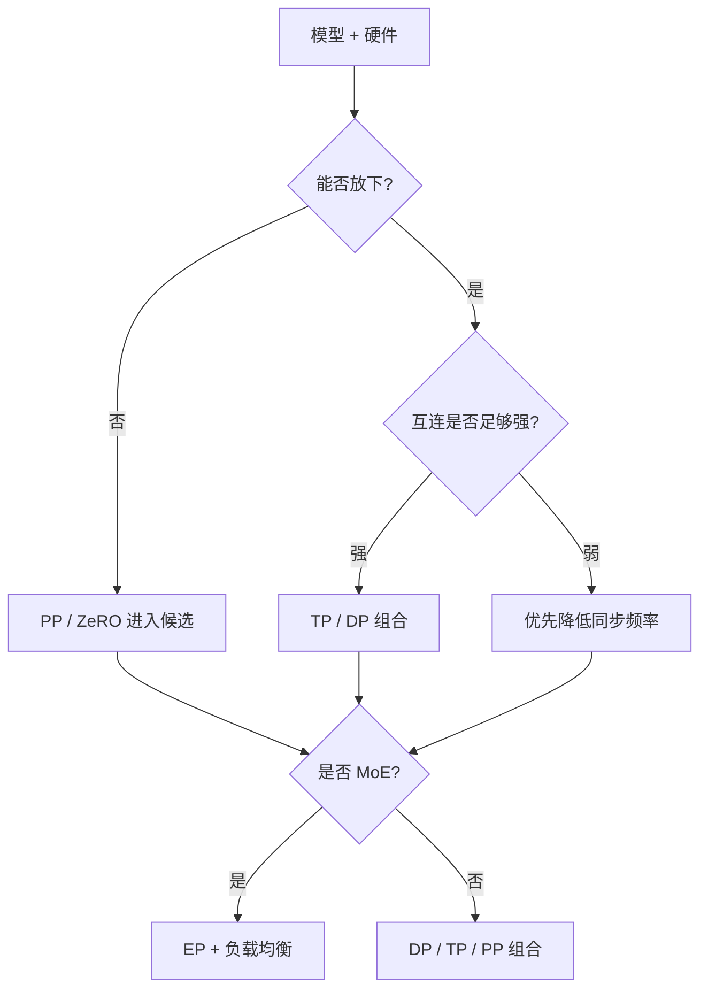

# 26. Parallel Strategy Decision Framework | 并行策略决策框架

**难度：** Hard | **环境：** CPU-first | **标签：** `DP`, `TP`, `PP` | **目标人群：** 多卡并行学习者

> 🚀 **云端运行环境**
>
> 本章节的实战代码可以点击以下链接在免费 GPU 算力平台上直接运行：
>
> [](https://colab.research.google.com/github/datawhalechina/llm-algo-leetcode/blob/main/01_Hardware_Math_and_Systems/26_Parallel_Strategy_Decision_Framework.ipynb)
> [](https://modelscope.cn/my/mynotebook) *(国内推荐：魔搭社区免费实例)*


这一页的目标不是重复介绍 DP / TP / PP / EP 的定义，而是回答更实用的问题：给定模型和硬件，应该怎么选并行策略，先选什么，再补什么。

**关键词：** `DP`, `TP`, `PP`

## 前置阅读

**导语：** 先把通信拓扑和显存切分的基础直觉接上，再看这页的并行策略选择，会更容易把“能不能放下”和“怎么切”连起来。

- [05. Communication Topologies | 通信拓扑与分布式基石](./05_Communication_Topologies.md)
- [06. VRAM Calculation and ZeRO | 显存计算与 ZeRO 优化](./06_VRAM_Calculation_and_ZeRO.md)

## 相关阅读

**导语：** 如果还想把并行策略放回系统语境里看，可以接着看并行调度和通信优化，把它和实际多卡训练一起理解。

- [20. NCCL and AllReduce Basics | NCCL 与 AllReduce 基础](./20_NCCL_and_AllReduce_Basics.md)
- [27. Communication Scheduling Optimization | 通信调度优化](./27_Communication_Scheduling_Optimization.md)
- [28. Fault Tolerance and Checkpointing | 容错与检查点](./28_Fault_Tolerance_and_Checkpointing.md)

## Q1：什么时候优先考虑 DP、TP、PP、EP？

<details>
<summary>点击展开查看解析</summary>

并行策略不要先背名字，先过三个门：

1. **Fit gate**：单卡显存能不能装下模型主体、梯度和优化器状态
2. **Interconnect gate**：互连带宽能不能承受切分后的高频同步
3. **Structure gate**：模型结构是不是天然支持层内、层间或专家级切分

从这个角度看，四种策略的职责并不一样：
- **DP** 解决“数据怎么铺开”，前提是模型至少接近能放下
- **TP** 解决“单层怎么拆算”，前提是机内互连足够强
- **PP** 解决“层怎么分段”，前提是模型足够深或单卡显存偏紧
- **EP** 解决“专家怎么分发”，前提是路由和 token 交换能承受

更准确地说，策略选择不是“谁更高级”，而是“哪个门先卡住，哪个切分层级就先上”。

| 维度 | DP | TP | PP | EP |
| --- | --- | --- | --- | --- |
| 主要切分对象 | batch / data | tensor / layer 内维度 | layers / stages | experts |
| 主要压力 | 梯度同步 | 层内 collective | pipeline bubble | dispatch / gather |
| 最关键前提 | 模型能放下或接近能放下 | 机内互连强 | 模型太深或显存紧 | MoE 路由可承受 |

粗略判断时可以把它理解为：
- DP 先解决“数据怎么分散”
- TP 先解决“单层怎么拆算”
- PP 先解决“层怎么分段”
- EP 先解决“专家怎么分发”
</details>


```python
def rank_parallel_strategies(model_gb, gpu_gb, interconnect_bw_gbps, is_moe=False):
    can_fit = model_gb <= gpu_gb * 0.8
    strong_link = interconnect_bw_gbps >= 600
    scores = {'DP': 0, 'TP': 0, 'PP': 0, 'EP': 0}

    # fit gate: 放不下时，PP/ZeRO 先上；能放下时，DP 才有基础。
    if can_fit:
        scores['DP'] += 3
    else:
        scores['PP'] += 4
        scores['DP'] -= 3

    # interconnect gate: 高带宽强互连更支持 TP / EP 这类高频通信。
    if strong_link:
        scores['TP'] += 3
        scores['EP'] += 1
    else:
        scores['TP'] -= 1
        scores['PP'] += 1

    # structure gate: MoE 直接抬高 EP 的权重。
    if is_moe:
        scores['EP'] += 4
        scores['TP'] += 1
    else:
        scores['TP'] += 1 if can_fit else 0

    ranking = sorted(scores.items(), key=lambda kv: kv[1], reverse=True)
    return {
        'can_fit': can_fit,
        'strong_link': strong_link,
        'ranking': ranking,
    }

cases = [
    (18, 24, 200, False),
    (40, 24, 200, False),
    (18, 24, 900, False),
    (18, 24, 900, True),
]
for case in cases:
    print(case, '->', rank_parallel_strategies(*case))
print('strategy choice should be ranked by fit, interconnect and structure gates')

```

## Q2：通信成本应该怎么判断？

<details>
<summary>点击展开查看解析</summary>

通信成本不要只看“总量”，要同时看两个维度：

- **带宽项**：单次搬运的数据有多大
- **频率项**：这个搬运动作在整个训练路径里重复多少次

可以把它粗略写成：
$$\text{cost} \approx \text{latency} \times \text{次数} + \frac{\text{data volume}}{\text{bandwidth}}$$

这也是为什么同样叫“通信”，不同策略的脆弱点完全不同：
- **DP** 的梯度同步偏全局，频率低，但每次同步面更完整
- **TP** 的层内通信频率高，单次量通常不大，但每层都要碰一次
- **PP** 的通信发生在 stage 边界，频率低一些，但切不好就会放大气泡和等待
- **EP** 不只看 volume，还要看 token 路由和负载均衡是否稳定

所以，判断并行策略时，真正要问的是：
- 这个通信是不是高频出现
- 它能不能被机内互连吃掉
- 它是不是会卡在同步点上，压掉计算重叠

如果频率高、带宽弱，策略再“高级”，最后也会被通信拖回去。
</details>


```python
def comm_time(freq, size_mb, bw_gbps, latency_us=2.0):
    # 把通信代价拆成固定延迟项和带宽项，才能看出为什么高频策略更脆弱。
    latency_ms = freq * latency_us / 1000.0
    bandwidth_ms = freq * size_mb * 8 / bw_gbps
    total_ms = latency_ms + bandwidth_ms
    return {
        'latency_ms': round(latency_ms, 2),
        'bandwidth_ms': round(bandwidth_ms, 2),
        'total_ms': round(total_ms, 2),
    }

cases = [
    ('DP', 1, 256, 900),
    ('TP', 24, 32, 900),
    ('PP', 8, 64, 64),
    ('EP', 16, 48, 900),
]
for name, freq, size_mb, bw in cases:
    print(name, '->', comm_time(freq, size_mb, bw))
print('high frequency amplifies latency, weak bandwidth amplifies payload cost')

```

## Q3：一个简单的决策框架是什么？

<details>
<summary>点击展开查看解析</summary>

更实用的决策框架不是“选一个单点策略”，而是按三个 gate 依次排除：

1. **Fit gate**：先看单卡能不能把模型主体放下
   - 放得下，DP 才有基础；放不下，PP / ZeRO 先进入候选
2. **Interconnect gate**：再看机内互连能不能支撑高频通信
   - 强互连更支持 TP / EP；弱互连更偏向降低同步频率
3. **Structure gate**：最后看模型是不是 dense 还是 MoE
   - dense 常见组合是 DP / TP / PP
   - MoE 需要把 EP 纳入主决策



这意味着并行策略通常不是单选题，而是先通过约束门，再决定切分层级和组合方式。

常见经验可以压成一句话：
- 先看显存门
- 再看互连门
- 最后看结构门
</details>


```python
def choose_parallel_plan(model_gb, gpu_gb, interconnect_bw_gbps, is_moe=False):
    # 先过显存门，再过互连门，最后看模型结构。
    can_fit = model_gb <= gpu_gb * 0.8
    strong_link = interconnect_bw_gbps >= 600

    if is_moe:
        if can_fit and strong_link:
            plan = ['EP', 'TP']
        elif can_fit:
            plan = ['EP', 'DP']
        else:
            plan = ['EP', 'PP']
        reason = 'moe gate'
    else:
        if not can_fit:
            plan = ['PP', 'ZeRO']
            if strong_link:
                plan.append('TP')
            reason = 'fit gate'
        elif strong_link:
            plan = ['DP', 'TP']
            reason = 'interconnect gate'
        else:
            plan = ['DP']
            reason = 'weak link gate'

    return {
        'can_fit': can_fit,
        'strong_link': strong_link,
        'plan': plan,
        'reason': reason,
    }

cases = [
    (18, 24, 200, False),
    (40, 24, 200, False),
    (18, 24, 900, False),
    (18, 24, 900, True),
]
for case in cases:
    print(case, '->', choose_parallel_plan(*case))
print('the plan is a gate sequence, not a single universal answer')

```

## Q4：这页最容易犯的错是什么？

<details>
<summary>点击展开查看解析</summary>

- **“并行维度越多越好”**  
  不对。并行维度越多，调度和通信也越复杂。

- **“只要切得更细，就一定更省显存”**  
  不对。切分能省显存，但也会带来额外同步和管理成本。

- **“DP 是最简单的，所以一定最优”**  
  不对。模型大到单卡放不下时，DP 根本不够。

- **“TP 一定要跨机”**  
  不对。TP 更适合放在机内强互连上。
</details>

```python
def strategy_risk_summary(parallel_plan):
    # 把常见误区转成可检查的风险标签，便于把文字判断落到最小模型上。
    tags = []
    if 'PP' in parallel_plan and 'DP' not in parallel_plan:
        tags.append('needs_pipeline_balance')
    if 'TP' in parallel_plan:
        tags.append('needs_strong_interconnect')
    if 'EP' in parallel_plan:
        tags.append('needs_router_balance')
    if not tags:
        tags.append('simple_dpd')
    return tags

plans = [
    ['DP'],
    ['TP', 'DP'],
    ['PP', 'ZeRO'],
    ['EP', 'TP'],
]
for plan in plans:
    print(plan, '->', strategy_risk_summary(plan))
print('the mistake is not choosing a plan, but ignoring the risk it introduces')

```
