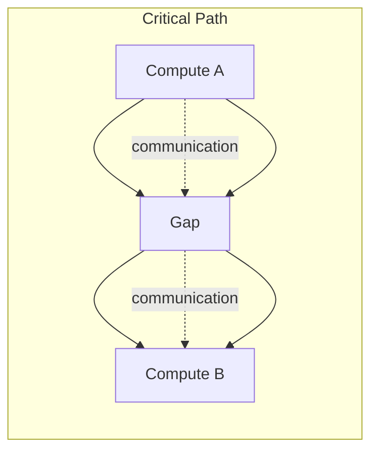

# 27. Communication Scheduling Optimization | 通信调度优化

**难度：** Hard | **环境：** CPU-first | **标签：** `通信优化`, `Overlap`, `All-Reduce` | **目标人群：** 想把分布式训练通信和计算重叠做好的学习者

> 🚀 **云端运行环境**
>
> 本章节的实战代码可以点击以下链接在免费 GPU 算力平台上直接运行：
>
> [](https://colab.research.google.com/github/datawhalechina/llm-algo-leetcode/blob/main/01_Hardware_Math_and_Systems/27_Communication_Scheduling_Optimization.ipynb)
> [](https://modelscope.cn/my/mynotebook) *(国内推荐：魔搭社区免费实例)*


这一页关注的不是“通信协议是什么”，而是“通信怎么排，才能尽量不挡住计算”。它的核心问题是：如何把通信放进计算间隙里。

**关键词：** `overlap`, `all-reduce`, `all-to-all`

## 前置阅读

**导语：** 这一页先接上通信拓扑、显存切分和并行策略判断，这样更容易理解为什么通信优化首先是调度问题。

- [05. Communication Topologies | 通信拓扑与分布式基石](./05_Communication_Topologies.md)
- [06. VRAM Calculation and ZeRO | 显存计算与 ZeRO 优化](./06_VRAM_Calculation_and_ZeRO.md)
- [26. Parallel Strategy Decision Framework | 并行策略决策框架](./26_Parallel_Strategy_Decision_Framework.md)

## 相关阅读

**导语：** 如果还想把通信优化和实现细节连起来，可以接着看通信原语、异步调度和容错，把调度、同步和恢复放在一起理解。

- [20. NCCL and AllReduce Basics | NCCL 与 AllReduce 基础](./20_NCCL_and_AllReduce_Basics.md)
- [28. Fault Tolerance and Checkpointing | 容错与检查点](./28_Fault_Tolerance_and_Checkpointing.md)
- [17. CUDA Stream and Asynchrony | CUDA Stream 与异步执行](./17_CUDA_Stream_and_Asynchrony.md)

## Q1：为什么通信优化首先是调度问题？

<details>
<summary>点击展开查看解析</summary>

通信是否挡住计算，先由**位置**决定，再由**带宽**决定。

如果通信点放在关键路径上，它就会直接暴露成停顿；如果通信能落在计算间隙里，同样的带宽条件下，体感就会完全不同。

所以这一页真正关心的不是“通信有没有”，而是：
- 通信点是不是太密
- 每个通信点是不是都落在关键路径上
- 计算间隙能不能把通信藏住

换句话说，调度决定了通信是否成为瓶颈的可见部分，带宽只是决定它有多重。
</details>


```python
def schedule_cost(comm_points, compute_blocks, overlap_ratio):
    # 调度成本 = 暴露出来的通信点 + 计算块切得太碎带来的额外压力 - overlap 带来的缓冲。
    exposed_points = comm_points * (1 - overlap_ratio)
    fragmentation = max(0, compute_blocks - comm_points)
    pressure = exposed_points * 3 + fragmentation * 0.5
    relief = overlap_ratio * 4
    return {
        'exposed_points': round(exposed_points, 2),
        'fragmentation': fragmentation,
        'schedule_pressure': round(pressure - relief, 2),
    }

for case in [(4, 8, 0.2), (2, 8, 0.6), (6, 4, 0.1)]:
    print(case, '->', schedule_cost(*case))
print('the lower the exposed communication points, the easier the schedule')

```

## Q2：为什么把小通信合并成大通信通常更稳？

<details>
<summary>点击展开查看解析</summary>

“小通信合并成大通信”真正省下来的，不只是字节数，而是**启动次数、同步次数和调度碎片**。

可以把这件事拆成三层：
- **launch 开销**：每次发起通信都要付固定代价
- **带宽利用**：更大的消息通常更容易吃满链路
- **流水线粒度**：合并太大又会挤压 overlap 空间

所以合并的目标不是“越大越好”，而是“把碎片变少，同时不把流水线切得太粗”。

这也是为什么通信优化经常不是先谈算法，而是先谈消息怎么排、在哪里合、合到什么粒度。
</details>


```python
def merge_tradeoff(num_small, merged_size_mb, bw_gbps, launch_cost=1.5):
    # 合并消息的收益 = 少发起几次 + 更稳定的带宽利用；代价 = 粒度变粗。
    launches_saved = max(num_small - 1, 0)
    launch_gain = launches_saved * launch_cost
    transfer_cost = merged_size_mb * 8 / bw_gbps
    granularity_penalty = max(merged_size_mb / 128 - 1, 0)
    return {
        'launch_gain': round(launch_gain, 2),
        'transfer_cost': round(transfer_cost, 2),
        'granularity_penalty': round(granularity_penalty, 2),
        'merge_score': round(launch_gain - transfer_cost - granularity_penalty, 2),
    }

for case in [(8, 64, 900), (8, 256, 900), (16, 128, 64)]:
    print(case, '->', merge_tradeoff(*case))
print('merge helps only when fewer launches are worth more than the larger chunk cost')

```

## Q3：为什么 All-Reduce / All-to-All 的优化目标不同？

<details>
<summary>点击展开查看解析</summary>

这两类通信的瓶颈不一样：

- **All-Reduce** 的核心是把同步代价压进计算之外，重点看是否能和反向传播重叠
- **All-to-All** 的核心是把路由和分发稳定下来，重点看 token 是否会形成局部拥塞

因此，优化目标也不同：
- All-Reduce 更关心**同步压力**和关键路径暴露
- All-to-All 更关心**路由压力**和设备间负载均衡

如果把两者都当成“只是搬数据”，就会错过真正的优化点。
</details>


```python
def comm_goal(kind, sync_pressure, routing_pressure):
    # 不同通信模式的优化目标不同：一个偏同步，一个偏路由。
    if kind == 'allreduce':
        score = sync_pressure * 2 - routing_pressure
        bottleneck = 'sync'
    elif kind == 'alltoall':
        score = routing_pressure * 2 - sync_pressure
        bottleneck = 'routing'
    else:
        score = 0
        bottleneck = 'unknown'
    return {'bottleneck': bottleneck, 'score': score}

for case in [('allreduce', 3, 1), ('alltoall', 1, 3), ('allreduce', 1, 3)]:
    print(case, '->', comm_goal(*case))
print('allreduce and all-to-all should be optimized against different bottlenecks')

```

## Q4：怎样把通信排进计算间隙？

<details>
<summary>点击展开查看解析</summary>

通信真正能藏进去，靠的不是“把链路弄快一点”，而是把它安排到计算间隙里。

常见手段有三类：
- **移动同步点**：把通信放到更自然的边界，而不是硬塞进关键路径
- **拆分大消息**：让部分通信更早或更晚发生，减少单次暴露
- **利用并发执行**：让独立的 kernel / stream / 传输彼此错开



所以，真正有效的优化往往不是“单次通信更快”，而是“通信尽量不出现在关键路径上”。
</details>


```python
def overlap_window(compute_ms, comm_ms, gap_ms):
    # 只有当通信能塞进计算间隙时，overlap 才真正成立。
    hidden = min(comm_ms, gap_ms)
    exposed = max(comm_ms - gap_ms, 0)
    overlap_ratio = hidden / comm_ms if comm_ms else 0
    critical_path = compute_ms + exposed
    return {
        'hidden_comm_ms': round(hidden, 2),
        'exposed_comm_ms': round(exposed, 2),
        'overlap_ratio': round(overlap_ratio, 2),
        'critical_path_ms': round(critical_path, 2),
    }

for case in [(40, 12, 2), (40, 12, 8), (10, 16, 4)]:
    print(case, '->', overlap_window(*case))
print('effective overlap depends on whether the gap can hide the communication')

```
