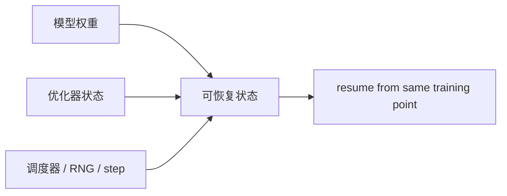
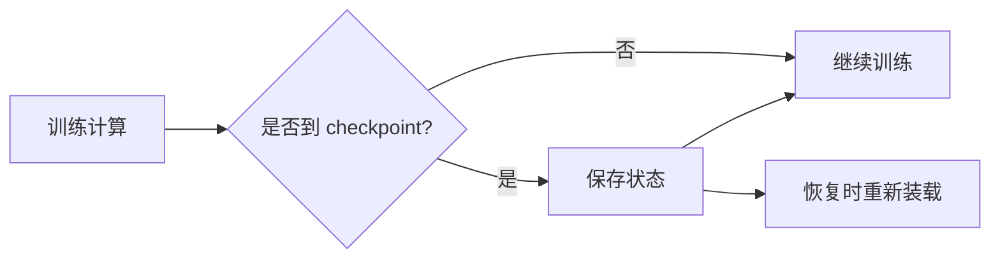

# 28. Fault Tolerance and Checkpointing | 容错与检查点

**难度：** Medium-Hard | **环境：** CPU-first | **标签：** `容错`, `Checkpoint`, `训练恢复` | **目标人群：** 长训练学习者

> 🚀 **云端运行环境**
>
> 本章节的实战代码可以点击以下链接在免费 GPU 算力平台上直接运行：
>
> [](https://colab.research.google.com/github/datawhalechina/llm-algo-leetcode/blob/main/01_Hardware_Math_and_Systems/28_Fault_Tolerance_and_Checkpointing.ipynb)
> [](https://modelscope.cn/my/mynotebook) *(国内推荐：魔搭社区免费实例)*


这一页关注的是“训练不能总假设一切顺利”。当任务很长、集群很大、资源很贵时，容错和 checkpoint 就不是可选项，而是训练系统的基础能力。

**关键词：** `checkpoint`, `recovery`, `fault tolerance`

## 前置阅读

**导语：** 先把显存压力、并行决策和通信调度这三件事弄清楚，再看这一页的容错和恢复，会更容易理解为什么 checkpoint 不是一个孤立动作。

- [06. VRAM Calculation and ZeRO | 显存计算与 ZeRO 优化](./06_VRAM_Calculation_and_ZeRO.md)
- [26. Parallel Strategy Decision Framework | 并行策略决策框架](./26_Parallel_Strategy_Decision_Framework.md)
- [27. Communication Scheduling Optimization | 通信调度优化](./27_Communication_Scheduling_Optimization.md)

## 相关阅读

**导语：** 如果还想把容错和工程实现连起来，可以接着看通信原语、异步调度和异构执行，把保存、恢复和调度放在一起理解。

- [20. NCCL and AllReduce Basics | NCCL 与 AllReduce 基础](./20_NCCL_and_AllReduce_Basics.md)
- [17. CUDA Stream and Asynchrony | CUDA Stream 与异步执行](./17_CUDA_Stream_and_Asynchrony.md)
- [29. CUDA Stream Advanced Scheduling | CUDA Stream 高级调度](./29_CUDA_Stream_Advanced_Scheduling.md)

## Q1：Checkpoint 保存的到底是什么？

<details>
<summary>点击展开查看解析</summary>

Checkpoint 保存的不是“模型文件”这么简单，而是一次训练能否继续的完整状态。

通常至少包括：
- 模型权重
- 优化器状态
- 学习率调度器状态
- 随机数种子
- 训练进度



如果只保存权重，恢复往往不够完整，也不一定能得到和中断前一致的训练轨迹。
</details>
### Q1小验证
- 用一个最小状态对象看看 checkpoint 为什么至少要保存权重、优化器、调度器、RNG 和进度。


```python
def checkpoint_state(model_mb, optimizer_mb, scheduler_mb, rng_mb, progress_mb):
    total = model_mb + optimizer_mb + scheduler_mb + rng_mb + progress_mb
    complete = all(v >= 0 for v in [model_mb, optimizer_mb, scheduler_mb, rng_mb, progress_mb]) and model_mb > 0
    return {
        'total_mb': total,
        'complete': complete,
        'has_optimizer_state': optimizer_mb > 0,
        'has_training_progress': progress_mb > 0,
    }

cases = [
    (2400, 1200, 12, 1, 4),
    (2400, 0, 12, 1, 4),
    (1200, 600, 6, 1, 0),
]
for case in cases:
    print(case, '->', checkpoint_state(*case))
print('checkpoint needs the full training state, not only model weights')

```

## Q2：为什么容错不是“出了问题再补救”？

<details>
<summary>点击展开查看解析</summary>

因为长训练的真正问题不是“会不会出故障”，而是“出故障后的代价能不能接受”。

- 任务越长，出故障概率越高
- 重新从头跑的损失可能非常大
- checkpoint 的目标，是把故障后的恢复成本压低

所以容错本质上是在控制总风险，而不是追求零故障。
</details>
### Q2小验证
- 用一个粗略故障模型看看故障概率和恢复代价如何影响容错预算。


```python
def failure_budget(hours, fault_rate_per_hour, restart_hours):
    expected_faults = hours * fault_rate_per_hour
    expected_recovery = expected_faults * restart_hours
    return {
        'expected_faults': round(expected_faults, 2),
        'expected_recovery_hours': round(expected_recovery, 2),
        'risk_level': 'high' if expected_faults >= 1 else 'manageable',
    }

cases = [(72, 0.02, 1.5), (72, 0.1, 1.5), (240, 0.03, 3.0)]
for case in cases:
    print(case, '->', failure_budget(*case))
print('the longer the run, the more checkpointing becomes a risk budget problem')

```

## Q3：保存和恢复为什么也有成本？

<details>
<summary>点击展开查看解析</summary>

Checkpoint 不是免费动作，它会把训练拆成“计算”和“保存 / 恢复”两部分。

如果保存太频繁，会拖慢训练；如果保存太少，一旦故障，回滚代价又会变大。分布式场景里，保存和恢复还会涉及并行 IO、一致性和调度窗口。



所以保存策略本身也要调度，不能只写一个“定时保存”的函数就结束。
</details>
### Q3小验证
- 用保存间隔、保存成本、故障成本算一下 checkpoint 策略的总开销。


```python
def checkpoint_tradeoff(train_minutes, interval_minutes, save_minutes, fail_minutes):
    checkpoints = max(train_minutes // interval_minutes, 1)
    save_cost = checkpoints * save_minutes
    expected_fail_cost = (train_minutes / 720.0) * fail_minutes
    total = train_minutes + save_cost + expected_fail_cost
    return {
        'checkpoints': checkpoints,
        'save_cost_minutes': round(save_cost, 2),
        'expected_fail_cost_minutes': round(expected_fail_cost, 2),
        'total_minutes': round(total, 2),
    }

cases = [(720, 60, 1.5, 40), (720, 30, 1.5, 40), (1440, 120, 2.0, 60)]
for case in cases:
    print(case, '->', checkpoint_tradeoff(*case))
print('checkpointing is a balance between save overhead and failure recovery cost')

```

## Q4：这页最容易犯的错是什么？

<details>
<summary>点击展开查看解析</summary>

- **“只要保存权重就够了”**  
  不够。完整恢复通常需要更多状态。

- **“checkpoint 越频繁越好”**  
  不对。频率太高会明显拖慢训练。

- **“恢复是训练结束后的额外工作”**  
  不对。恢复设计从一开始就要和训练流程一起考虑。

- **“容错只影响失败那一刻”**  
  不对。它影响的是整个训练周期的风险预算。
</details>
### Q4小验证
- 用几个错误类型快速判断 checkpoint 方案最容易在哪类设计上出问题。


```python
def checkpoint_mistake(kind):
    mapping = {
        'weights_only': 'state_incomplete',
        'too_frequent': 'training_overhead',
        'too_sparse': 'recovery_expensive',
        'no_budget_model': 'risk_not_budgeted',
    }
    return mapping.get(kind, 'unknown')

for kind in ['weights_only', 'too_frequent', 'too_sparse', 'no_budget_model']:
    print(kind, '->', checkpoint_mistake(kind))
print('the most common mistakes come from incomplete state, wrong cadence, and missing risk budget')

```
