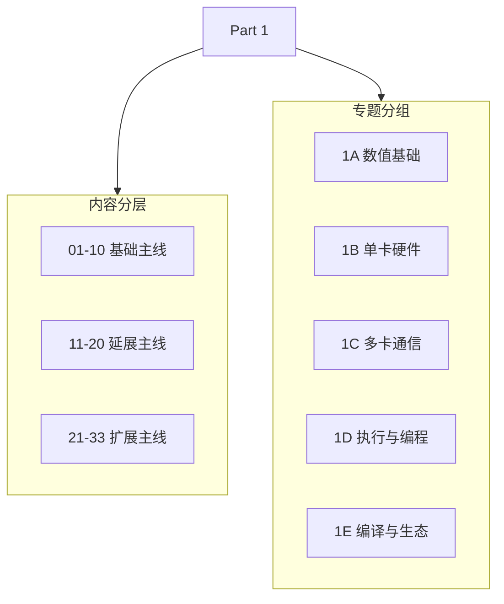

# Part 01: Hardware, Math, and Systems | 第一部分：硬件、数学与系统

## Part Overview | Part 概览

本部分主线覆盖 33 个讨论题（01-33），共同把第零部分的基础能力连接到第二至第五部分的工程实现。其中 `01-10` 是基础主线，`11-20` 是延展主线，`21-33` 是同类扩展主线。正文默认 notebook-first，主线页尽量与 notebook 同页。

Part 1 按 5 个专题组织：`1A`、`1B`、`1C`、`1D`、`1E` 分别承担数值基础、单卡硬件、多卡通信、异构调度和编译生态这五条主线。具体每组怎么读、怎么接后续 Part，由各组导航页分别说明。

## Part Asset Overview | Part 资产总览

本章内容按 5 个主线组组织，后续页面也沿该结构继续扩展。

> 导航说明：侧边栏和组级入口默认收起，先看总览，再点开具体组页。
> 组页是知识包，不需要把整组一次性读完；先抓主线，再按需要查看同组章节页。
> Part 1 不只是知识目录，也是 Part 2-5 的共同前置底座。

| 学习组 | 核心职责 | 当前内容映射 | 每组多少节 |
|:---|:---|:---|:---|
| [Group 1A: Numerical Foundations and Scale Estimation | 1A: 数值基础与算力估算](./1A.md) | 建立数量级与资源账本 | [01. Data Types and Precision | 大模型的数据格式与混合精度](./01_Data_Types_and_Precision.ipynb)、[02. LLM Params and FLOPs | 大模型参数量与算力推导](./02_LLM_Params_and_FLOPs.ipynb)、[21. Quantization Theory and INT4/INT8 | 量化理论与 INT4/INT8](./21_Quantization_Theory_and_INT4_INT8.ipynb)、[22. MoE Parameter and Compute | MoE 模型参数量计算](./22_MoE_Parameter_and_Compute.ipynb) | 4 |
| [Group 1B: Single-GPU Hardware and Memory Optimization | 1B: 单卡硬件与访存优化](./1B.md) | 识别单卡瓶颈与访存路径 | [03. GPU Architecture and Memory | GPU 物理架构与内存层级](./03_GPU_Architecture_and_Memory.ipynb)、[04. Attention Variants and Memory Optimization | 注意力机制变体与显存优化](./04_Attention_Memory_Optimization.ipynb)、[23. TensorCore Deep Dive | Tensor Core 深度剖析](./23_TensorCore_Deep_Dive.ipynb)、[24. SRAM Optimization Techniques | SRAM 优化技术](./24_SRAM_Optimization_Techniques.ipynb)、[25. Sparse Computation and Sparse Attention | 稀疏计算与稀疏注意力](./25_Sparse_Computation_and_Sparse_Attention.ipynb) | 5 |
| [Group 1C: Distributed Communication and Memory Sharing | 1C: 多卡通信与显存共享](./1C.md) | 刻画多卡通信边界与切分代价 | [05. Communication Topologies | 通信拓扑与分布式基石](./05_Communication_Topologies.ipynb)、[06. VRAM Calculation and ZeRO | 显存计算与 ZeRO 优化](./06_VRAM_Calculation_and_ZeRO.ipynb)、[26. Parallel Strategy Decision Framework | 并行策略决策框架](./26_Parallel_Strategy_Decision_Framework.ipynb)、[27. Communication Scheduling Optimization | 通信调度优化](./27_Communication_Scheduling_Optimization.ipynb)、[28](./28_Fault_Tolerance_and_检查点.ipynb) | 5 |
| [Group 1D: Heterogeneous Scheduling and Operator Programming | 1D: 异构调度与算子编程](./1D.md) | 掌握运行时调度与算子映射 | [07. CPU and GPU Heterogeneous Scheduling | CPU 与 GPU 异构调度](./07_CPU_GPU_Heterogeneous_Scheduling.ipynb)、[08. Programming Models and CUDA/Triton | 编程模型演进](./08_Programming_Models_CUDA_Triton.ipynb)、[29. CUDA Stream Advanced Scheduling | CUDA Stream 高级调度](./29_CUDA_Stream_Advanced_Scheduling.ipynb)、[30. Dynamic Shape Handling | 动态 Shape 处理](./30_Dynamic_Shape_Handling.ipynb)、[31. GPU Virtualization and MIG | GPU 虚拟化与 MIG](./31_GPU_Virtualization_and_MIG.ipynb) | 5 |
| [Group 1E: Compiler Optimization and Hardware Ecosystem | 1E: 编译优化与硬件生态](./1E.md) | 建立编译优化与选型判断 | [09. AI Compilers and Graph Optimization | AI 编译器与计算图优化](./09_AI_Compilers_and_Graph_Optimization.ipynb)、[10. AI Chips Overview and Alternatives | 算力现状与替代方案](./10_Domestic_AI_Chips_Overview.ipynb)、[32. TVM / MLIR Deep Practice | TVM / MLIR 深度实践](./32_TVM_MLIR_Deep_Practice.ipynb)、[33. TCO and Cost Model | 算力评估与 TCO 模型](./33_TCO_and_Cost_Model.ipynb) | 4 |

## Learning Path | 学习路径

Part 1 不只是知识目录，也是 Part 2 到 Part 5 的共同前置。阅读上可以按三层理解：`01-10` 是基础主线，`11-20` 是延展主线，`21-33` 是扩展主线。

### Recommended Order | 推荐顺序

- 快速入门：先看 [Group 1A: Numerical Foundations and Scale Estimation | 1A: 数值基础与算力估算](./1A.md) → [Group 1B: Single-GPU Hardware and Memory Optimization | 1B: 单卡硬件与访存优化](./1B.md)
- 系统学习：按 [Group 1A: Numerical Foundations and Scale Estimation | 1A: 数值基础与算力估算](./1A.md) → [Group 1B: Single-GPU Hardware and Memory Optimization | 1B: 单卡硬件与访存优化](./1B.md) → [Group 1C: Distributed Communication and Memory Sharing | 1C: 多卡通信与显存共享](./1C.md) → [Group 1D: Heterogeneous Scheduling and Operator Programming | 1D: 异构调度与算子编程](./1D.md) → [Group 1E: Compiler Optimization and Hardware Ecosystem | 1E: 编译优化与硬件生态](./1E.md) 顺序推进

### Next Steps | 后续衔接

- 先看 [Group 1A: Numerical Foundations and Scale Estimation | 1A: 数值基础与算力估算](./1A.md)、[Group 1B: Single-GPU Hardware and Memory Optimization | 1B: 单卡硬件与访存优化](./1B.md)，把精度、参数量、GPU 架构和访存直觉先立起来，主要服务 Part 2 / Part 3。
- 先看 [Group 1C: Distributed Communication and Memory Sharing | 1C: 多卡通信与显存共享](./1C.md)、[Group 1D: Heterogeneous Scheduling and Operator Programming | 1D: 异构调度与算子编程](./1D.md)，把通信、调度、block / warp / shared memory 和 Triton block model 理顺，主要服务 Part 3。
- 先看 [Group 1E: Compiler Optimization and Hardware Ecosystem | 1E: 编译优化与硬件生态](./1E.md)，再结合 [19. Operator Fusion Introduction | 算子融合导论](./19_Operator_Fusion_Introduction.ipynb)、[32. TVM / MLIR Deep Practice | TVM / MLIR 深度实践](./32_TVM_MLIR_Deep_Practice.ipynb)、[33. TCO and Cost Model | 算力评估与 TCO 模型](./33_TCO_and_Cost_Model.ipynb)，理解编译优化、算子融合、TCO，以及为什么后面会从 PyTorch 走到 Triton，再走到 CUDA，主要服务 Part 2 / Part 3。

## Environment Notes | 环境说明

- 默认按 `CPU-first` 设计
- 这里只写 Part 级统一前提，不点到具体节号
- 少数页面如需 `GPU optional` 或 `GPU required`，以后续单页说明为准
