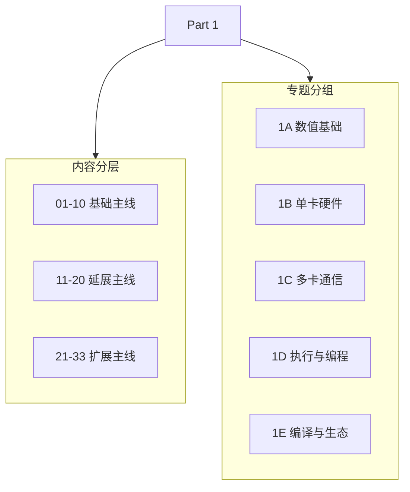

# Part 01: Hardware, Math, and Systems | 第一部分：硬件、数学与系统

## Part Overview | Part 概览

本部分主线覆盖 33 个讨论题（01-33），共同把第零部分的基础能力连接到第二至第五部分的工程实现。其中 `01-10` 是基础主线，`11-20` 是延展主线，`21-33` 是同类扩展主线。正文默认 notebook-first，主线页尽量与 notebook 同页。

Part 1 按 5 个专题组织：`1A`、`1B`、`1C`、`1D`、`1E` 分别承担数值基础、单卡硬件、多卡通信、异构调度和编译生态这五条主线。具体每组怎么读、怎么接后续 Part，由各组导航页分别说明。

## Part Asset Overview | Part 资产总览

本章内容按 5 个主线组组织，后续页面也沿该结构继续扩展。

> 导航说明：侧边栏和组级入口默认收起，先看总览，再点开具体组页。
> 组页是知识包，不需要把整组一次性读完；先抓主线，再按需要查看同组章节页。
> Part 1 不只是知识目录，也是 Part 2-5 的共同前置底座。

| 学习组 | 核心职责 | 当前内容映射 | 每组多少节 |
|:---|:---|:---|:---|
| [1A](./1A.md) | 建立数量级与资源账本 | [01](./01_Data_Types_and_Precision.md)、[02](./02_LLM_Params_and_FLOPs.md)、[21](./21_Quantization_Theory_and_INT4_INT8.md)、[22](./22_MoE_Parameter_and_Compute.md) | 4 |
| [1B](./1B.md) | 识别单卡瓶颈与访存路径 | [03](./03_GPU_Architecture_and_Memory.md)、[04](./04_Attention_Memory_Optimization.md)、[23](./23_TensorCore_Deep_Dive.md)、[24](./24_SRAM_Optimization_Techniques.md)、[25](./25_Sparse_Computation_and_Sparse_Attention.md) | 5 |
| [1C](./1C.md) | 刻画多卡通信边界与切分代价 | [05](./05_Communication_Topologies.md)、[06](./06_VRAM_Calculation_and_ZeRO.md)、[26](./26_Parallel_Strategy_Decision_Framework.md)、[27](./27_Communication_Scheduling_Optimization.md)、[28](./28_Fault_Tolerance_and_Checkpointing.md) | 5 |
| [1D](./1D.md) | 掌握运行时调度与算子映射 | [07](./07_CPU_GPU_Heterogeneous_Scheduling.md)、[08](./08_Programming_Models_CUDA_Triton.md)、[29](./29_CUDA_Stream_Advanced_Scheduling.md)、[30](./30_Dynamic_Shape_Handling.md)、[31](./31_GPU_Virtualization_and_MIG.md) | 5 |
| [1E](./1E.md) | 建立编译优化与选型判断 | [09](./09_AI_Compilers_and_Graph_Optimization.md)、[10](./10_Domestic_AI_Chips_Overview.md)、[32](./32_TVM_MLIR_Deep_Practice.md)、[33](./33_TCO_and_Cost_Model.md) | 4 |

## Learning Path | 学习路径

Part 1 不只是知识目录，也是 Part 2 到 Part 5 的共同前置。阅读上可以按三层理解：`01-10` 是基础主线，`11-20` 是延展主线，`21-33` 是扩展主线。

### Recommended Order | 推荐顺序

- 快速入门：先看 [1A](./1A.md) → [1B](./1B.md)
- 系统学习：按 [1A](./1A.md) → [1B](./1B.md) → [1C](./1C.md) → [1D](./1D.md) → [1E](./1E.md) 顺序推进

### Next Steps | 后续衔接

- 先看 [1A](./1A.md)、[1B](./1B.md)，把精度、参数量、GPU 架构和访存直觉先立起来，主要服务 Part 2 / Part 3。
- 先看 [1C](./1C.md)、[1D](./1D.md)，把通信、调度、block / warp / shared memory 和 Triton block model 理顺，主要服务 Part 3。
- 先看 [1E](./1E.md)，再结合 [19](./19_Operator_Fusion_Introduction.md)、[32](./32_TVM_MLIR_Deep_Practice.md)、[33](./33_TCO_and_Cost_Model.md)，理解编译优化、算子融合、TCO，以及为什么后面会从 PyTorch 走到 Triton，再走到 CUDA，主要服务 Part 2 / Part 3。

## Environment Notes | 环境说明

- 默认按 `CPU-first` 设计
- 这里只写 Part 级统一前提，不点到具体节号
- 少数页面如需 `GPU optional` 或 `GPU required`，以后续单页说明为准
