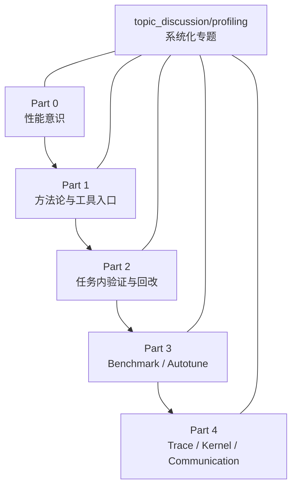

# Profiling 专题

## 专题概览
本专题用于沉淀贯穿 Part 0-4 的性能意识、profiling 方法和瓶颈定位经验。
Profiling 之所以重要，是因为大模型训练和推理中的很多瓶颈并不是“代码写错了”，而是算子、通信、显存和调度之间的真实系统代价没有被看见。没有 profiling，就很难判断优化应该先从哪里入手，也很难判断一次改动到底是提升还是退化。

## 职责边界

这个专题和 `Part 0-4` 是两条正交的线：

- `Part` 线负责按章节推进学习深度，解决“这一阶段应该学什么”。
- `topic_discussion/profiling` 线负责把 profiling 这件事做深做透，解决“应该怎么看、怎么测、怎么判断、怎么回改”。

更具体地说：

- `Part 0` 放最小性能意识和计时习惯。
- `Part 1` 放 profiling 方法论和工具入口。
- `Part 2` 放把 profiling 嵌进真实任务后的验证和回改。
- `Part 3` 放 benchmark、autotune 和 throughput profiling。
- `Part 4` 放 trace 解读、kernel / communication 瓶颈定位和系统级调优。

## 专题内容
- Part 0：性能意识启蒙和最小计时习惯
- Part 1：profiling 方法入门和工具分层
- Part 2：训练 / 推理 / 显存验证中的收益证明
- Part 3：benchmark / autotune / throughput profiling
- Part 4：trace 解析、kernel 瓶颈和 communication 瓶颈定位

## 推荐入口

- 先看 `Part 1`，建立 profiling 的方法论和工具入口。
- 再看 `Part 2`，把 profiling 放进真实任务里验证收益。
- 如果想看更深的工具读法、案例拆解和系统化方法，再回到本专题继续补充。

## 专题状态
当前为专题入口页，后续将逐步补充更完整的跨 Part 索引、工具读法和案例拆解。
